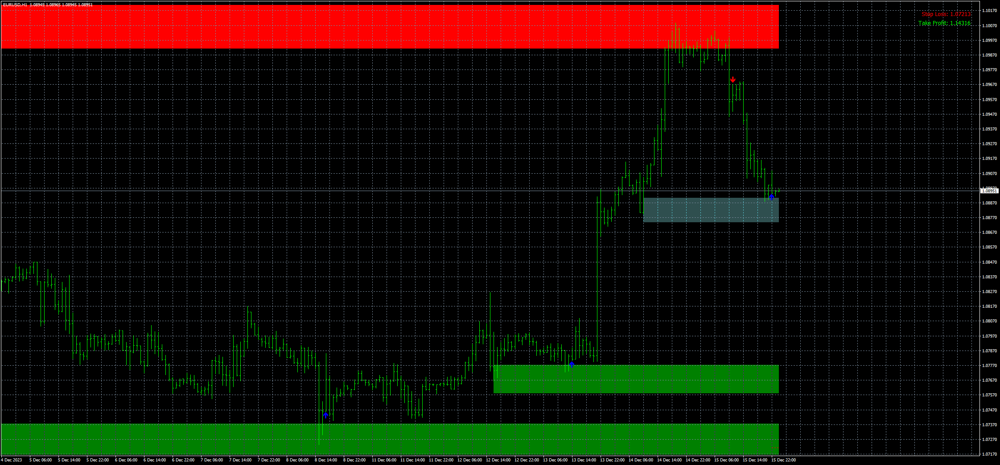
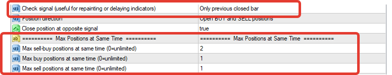
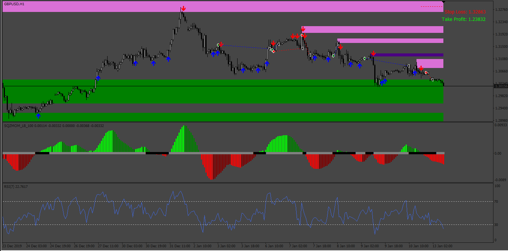
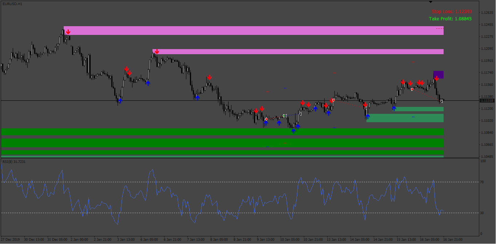

# Supply_Demand_Pro_EA_v1.00

> Source: https://fxcodebase.com/code/viewtopic.php?f=38&t=74545  
> Forum: 38 · Topic 74545 · 15 post(s)

---

## Supply_Demand_Pro_EA_v1.00

**Apprentice** · Wed Jan 17, 2024 12:25 pm

Based on the request.
[https://fxcodebase.com/code/viewtopic.php?f=27&p=153892](https://fxcodebase.com/code/viewtopic.php?f=27&p=153892)

The indicator must be attached to the chart, the EA read arrow objects placed by the indicator.

 [Supply Demand Pro.ex4](files/154095/Supply%20Demand%20Pro.ex4)

 [Supply_Demand_Pro_EA_v1.00.mq4](files/154095/Supply_Demand_Pro_EA_v1.00.mq4)

---

## Re: Supply_Demand_Pro_EA_v1.00

**rickCreations** · Wed Jan 17, 2024 11:38 pm

trailing stop in the sell positions are not working the same as trailing stops in the buy positions. can not see stoploss moving at all it is like ordermodify is not being triggered.

on the buy orders it works fine.

how i am testing.
TP = OFF
SL = OFF
Trailstop = ON

---

## Re: Supply_Demand_Pro_EA_v1.00

**Apprentice** · Sat Jan 20, 2024 4:14 am

We have added your request to the development list.
Development reference 76

---

## Re: Supply_Demand_Pro_EA_v1.00

**white21** · Wed Jan 24, 2024 4:27 am

First of all, thank you for your work. I want to talk about a few problems I see.
1) I think the control signal: "Only previous closed bar" part does not work. When he sees the signal in the previous bar, he needs to enter the transaction, but he does not.
2) maximum simultaneous sell-buy positions. Here, if the transaction is TP or SL, the counter is reset, looks back again and if there is an arrow, it opens the transaction again. There must be a limitation there. Otherwise, when fast TP-SL is performed, it means opening a transaction again immediately. Consider 1 hour, 4 hour candles.

---

## Re: Supply_Demand_Pro_EA_v1.00

**trtrader** · Sat Apr 13, 2024 9:59 am

Any update on this? seems profitable

---

## Re: Supply_Demand_Pro_EA_v1.00

**trtrader** · Sat Apr 13, 2024 10:45 am

Could you please add the squeeze momentum indicator as a filter based on histogram colours?

Allow only buy: Mormon and lime green
Allow only sell: Dark green and red

Even without the filter its performing fine but can be much better with the momentum filter.

[https://www.mql5.com/en/code/39636](https://www.mql5.com/en/code/39636)

---

## Re: Supply_Demand_Pro_EA_v1.00

**trtrader** · Sat Apr 13, 2024 4:14 pm

Also, it would be great to take % profit based on RSI levels.

Example: for buy orders, take 30% of the profit each time RSI crosses down the level 70

---

## Re: Supply_Demand_Pro_EA_v1.00

**trtrader** · Mon Apr 15, 2024 12:22 pm

is there any way to open orders with suggested stop loss and take profit numbers on the right top of the chart and add extra optional pips.?

---

## Re: Supply_Demand_Pro_EA_v1.00

**Apprentice** · Mon Apr 22, 2024 11:30 am

We have added your request to the development list.
Development reference 329

---

## Re: Supply_Demand_Pro_EA_v1.00

**Apprentice** · Tue May 07, 2024 3:17 am

 [Supply_Demand_Pro_EA_v1.01.mq4](files/155256/Supply_Demand_Pro_EA_v1.01.mq4)

---

## Re: Supply_Demand_Pro_EA_v1.00

**trtrader** · Thu May 23, 2024 7:52 am

This EA opening positions nonstop until supply demand direction changes.

Could you please make it optional?

Add in the menu an option called non-stop. If true, keep it working as is. if false, don't open any new position if the current order closes for any reason stop loss, take profit etc... until a new signal.

---

## Re: Supply_Demand_Pro_EA_v1.00

**trtrader** · Thu May 23, 2024 9:10 am

Oh forgot to say, also could you please add RSI filter? No trades below 30 or above 70 by default.

I like the non-stop mode but the problem is sometimes it opens the continuation order right at the supply or demand zone which ends up a losing trade.

If you can implement a rule for entering non-stop orders on pullback, rather than right away, that would be great.

Thanks

---

## Re: Supply_Demand_Pro_EA_v1.00

**Apprentice** · Tue May 28, 2024 5:17 am

We have added your request to the development list.
Development reference 441

---

## Re: Supply_Demand_Pro_EA_v1.00

**Apprentice** · Thu May 30, 2024 12:57 pm

 [Supply_Demand_Pro_EA_v1.01.mq4](files/155571/Supply_Demand_Pro_EA_v1.01.mq4)

---

## Re: Supply_Demand_Pro_EA_v1.00

**Apprentice** · Mon Aug 18, 2025 11:36 am

SQZMOM_LB_100
[https://www.mql5.com/en/code/39636](https://www.mql5.com/en/code/39636)

 [Supply_Demand_Pro_EA_v1.10.mq4](files/160278/Supply_Demand_Pro_EA_v1.10.mq4)
