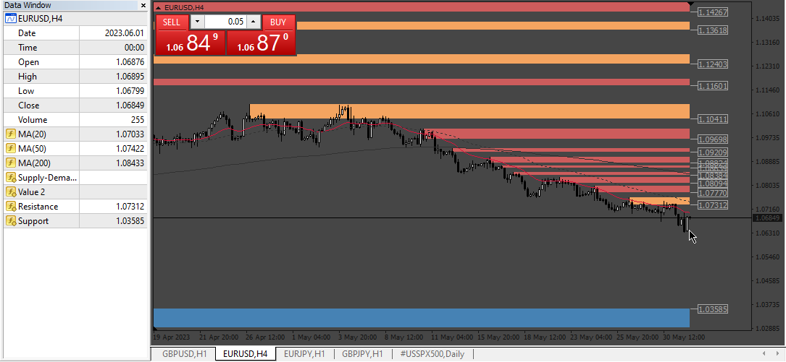
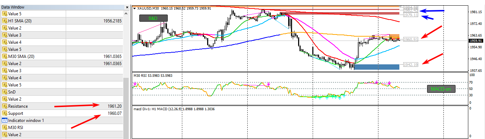
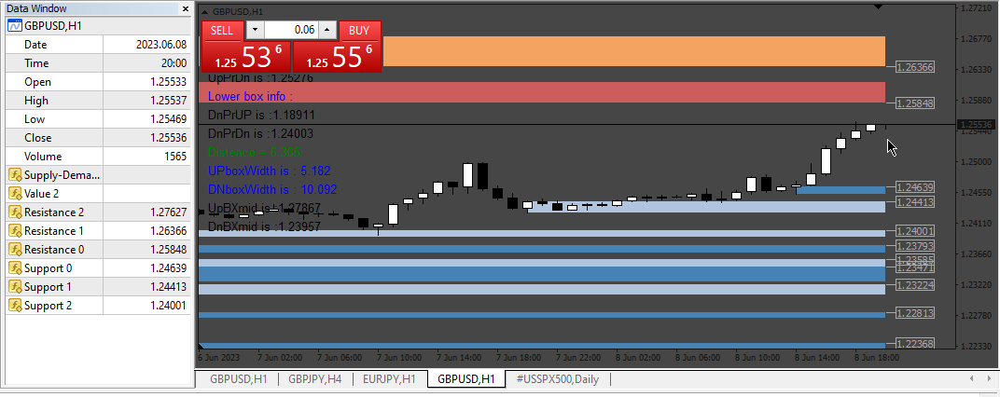

# Supply-Demand-Zones_ahtf_BT

> Source: https://fxcodebase.com/code/viewtopic.php?f=38&t=73792  
> Forum: 38 · Topic 73792 · 5 post(s)

---

## Supply-Demand-Zones_ahtf_BT

**Apprentice** · Sun Jun 04, 2023 2:46 am

Based on the request.
[https://fxcodebase.com/code/viewtopic.php?f=27&p=151057](https://fxcodebase.com/code/viewtopic.php?f=27&p=151057)

 [Supply-Demand-Zones_ahtf_BT.mq4](files/151101/Supply-Demand-Zones_ahtf_BT.mq4)

---

## Re: Supply-Demand-Zones_ahtf_BT

**GrowUpEveryDay** · Sun Jun 04, 2023 9:05 am

It's possible to add more level?
At least 3 price above and 3 price below. That's are our TP/SL should be.

Much appreciate your help. Thank you

---

## Re: Supply-Demand-Zones_ahtf_BT

**Apprentice** · Mon Jun 05, 2023 3:26 pm

We have added your request to the development list.
Development reference 503.

---

## Re: Supply-Demand-Zones_ahtf_BT

**GrowUpEveryDay** · Tue Jun 06, 2023 12:42 am

Btw just check out the indicator, it's not work as it should be

 

it show different price on data window (red arrow)
I would like to get at least 3 price above current price. and 3 price below current price (blue arrow)

Thank you

---

## Re: Supply-Demand-Zones_ahtf_BT

**Apprentice** · Mon Jun 12, 2023 3:13 pm

 [Supply-Demand-Zones_ahtf_BT.mq4](files/151201/Supply-Demand-Zones_ahtf_BT.mq4)
