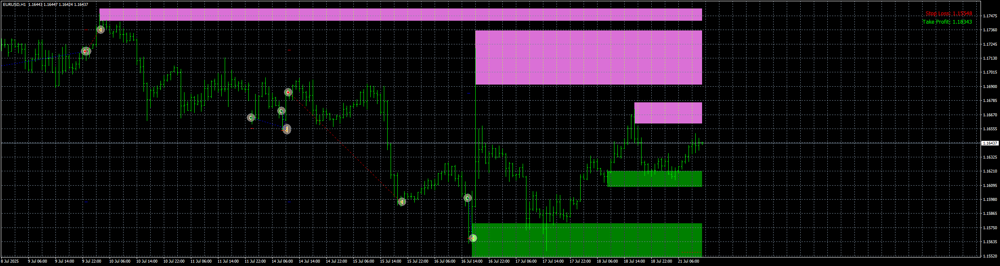

# Supply-Demand-Zones_EA_v1.10

> Source: https://fxcodebase.com/code/viewtopic.php?f=38&t=76169  
> Forum: 38 · Topic 76169 · 7 post(s)

---

## Supply-Demand-Zones_EA_v1.10

**Apprentice** · Mon Jul 21, 2025 5:06 am

Based on request.
[https://fxcodebase.com/code/viewtopic.p ... 75#p159875](https://fxcodebase.com/code/viewtopic.php?f=27&p=159875#p159875)

 [Supply Demand Pro.ex4](files/159971/Supply%20Demand%20Pro.ex4)

 [Supply-Demand-Zones_EA_v1.10.mq4](files/159971/Supply-Demand-Zones_EA_v1.10.mq4)

---

## Re: Supply-Demand-Zones_EA_v1.10

**Appu264** · Thu Jul 31, 2025 6:18 am

Add as input one buy and one sell trade per day change as requirement and after market open

---

## Re: Supply-Demand-Zones_EA_v1.10

**Apprentice** · Mon Aug 04, 2025 4:34 am

We have added your request to the development list.
Development reference 494

---

## Re: Supply-Demand-Zones_EA_v1.10

**Satya264** · Thu Aug 07, 2025 11:40 pm

MAKE IT MT5 VERSION

---

## Re: Supply-Demand-Zones_EA_v1.10

**Apprentice** · Sun Aug 10, 2025 4:54 am

We have added your request to the development list.
Development reference 500

---

## Re: Supply-Demand-Zones_EA_v1.10

**Apprentice** · Mon Aug 11, 2025 4:12 am

Task 494

 [Supply-Demand-Zones_EA_v1.10.mq4](files/160211/Supply-Demand-Zones_EA_v1.10.mq4)

---

## Re: Supply-Demand-Zones_EA_v1.10

**Apprentice** · Sat Sep 27, 2025 2:57 pm

Task 500

 [Supply_Demand.mq5](files/160630/Supply_Demand.mq5)

 [SD_EA_v1.00.mq5](files/160630/SD_EA_v1.00.mq5)
