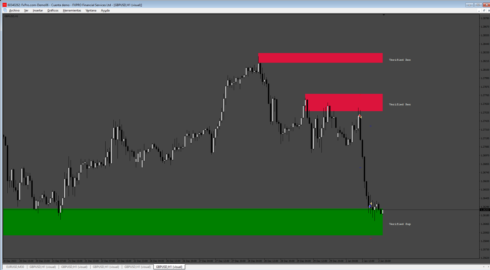
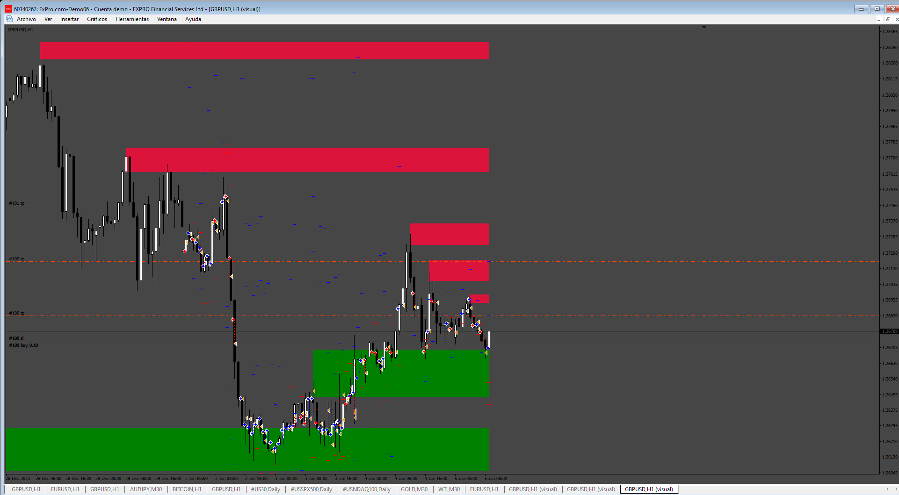
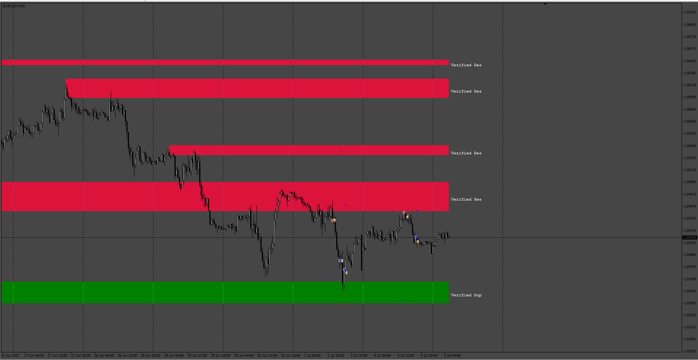

# SupplyDemand_EA

> Source: https://fxcodebase.com/code/viewtopic.php?f=38&t=76102  
> Forum: 38 · Topic 76102 · 6 post(s)

---

## SupplyDemand_EA

**Apprentice** · Sun Jun 29, 2025 12:08 pm

Based on the request.
[https://fxcodebase.com/code/viewtopic.php?f=38&t=76065](https://fxcodebase.com/code/viewtopic.php?f=38&t=76065)

 [shved_supply_and_demand_v1.ex4](files/159780/shved_supply_and_demand_v1.ex4)

 [SupplyDemand_EA.mq4](files/159780/SupplyDemand_EA.mq4)

---

## Re: SupplyDemand_EA

**Satya264** · Tue Jul 08, 2025 1:43 am

PLEASE DO ONE WORK ON INDICATOR
MAKE A SHOW 5 TIME FRAME ZONE SHOW IN ONE TIME FRAME
LIKE H1 M30 M15 M5 M1 SHOW ALL ZONE IN ONE CHART
H1 M30 M15 M5 M1 (TRUE OR FALSE) EACH TIME
 FRAME ON SHOW ON ONE CHART

MAKE THE EA WORKS ON THIS INDICATOR
TRADE ON 1 TO 5 TIME FRAME SUPPLY OR DEMAND ZONE SHOW ON ONE CHART
IF 1 OR 5 ZONE SHOW ON CHART THEN TRADE OPEN IN ALL ZONE
entry rules when price retouch supply zone open a sell trade and
entry rules when price retouch damand zone open a buy trade
and one trade per one zone
tp next supply zone for buy trade (true or false)
tp next demand zone for sell trade (true or false)
sl beyond the zone (true or false)
CLOSE ON OPPOSITE (TRUE OR FALSE)
ADD A OPTION IN TP AND SL BY PIPS (TRUE OR FALSE)

---

## Re: SupplyDemand_EA

**Apprentice** · Sun Jul 13, 2025 3:37 am

We have added your request to the development list.
Development reference 455

---

## Re: SupplyDemand_EA

**Apprentice** · Fri Jul 18, 2025 6:54 am

 [SupplyDemand_EA_v2.mq4](files/159948/SupplyDemand_EA_v2.mq4)

---

## Re: SupplyDemand_EA

**Apprentice** · Thu Aug 21, 2025 3:48 am

 [SupplyDemand_EA_verif.mq4](files/160311/SupplyDemand_EA_verif.mq4)

---

## Re: SupplyDemand_EA

**BeingSimple** · Fri Aug 22, 2025 5:49 am

Dear Apprentice ...>

Thank you for all your efforts and excellent support.

Regarding this Supply_Demand EA or Indicator ( based on SHVED Supply_ Demand),
There are so many posts and uploads you have done.
It is really helpful.

At this point, it really got confused as there are many version of it spread across many threads.
I always see the post date to find the latest. But still, i have a request for you.

PLEASE make a sperate post or something..>
Where you post the latest and most updated "SHVED Supply_ Demand " Indicator & EA ...

So new comers or learners like me.. will find it easier to track & download.

Thank you sir
