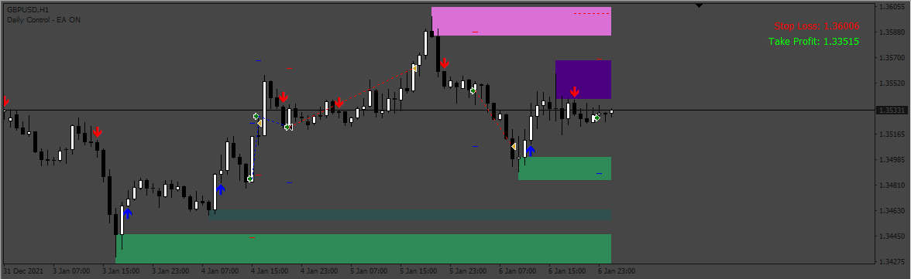
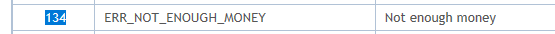
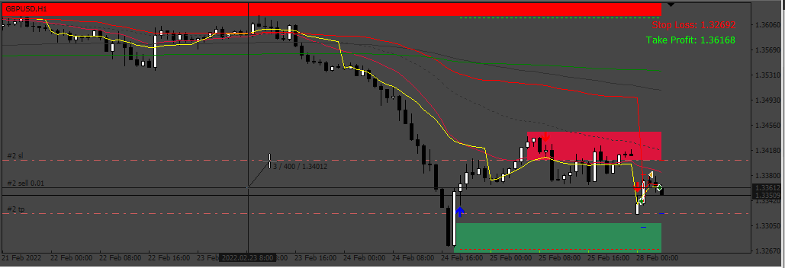
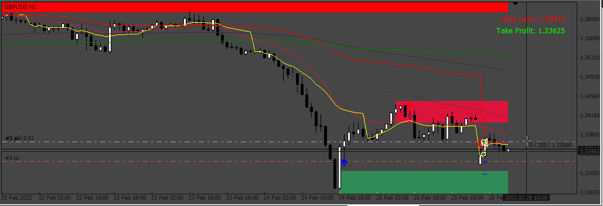

# SupplyDemand_VWAP_EA

> Source: https://fxcodebase.com/code/viewtopic.php?f=38&t=72884  
> Forum: 38 · Topic 72884 · 13 post(s)

---

## SupplyDemand_VWAP_EA

**Apprentice** · Tue Nov 01, 2022 5:12 am

Based on the request.
[https://fxcodebase.com/code/viewtopic.php?f=27&p=147997](https://fxcodebase.com/code/viewtopic.php?f=27&p=147997)

The "Supply Demand Pro" indicator draws arrows as objects not from the buffer so we have to attach it to the chart.
"VWAP" indicator works from the buffer, no need to attach

 [SupplyDemand_VWAP_EA.mq4](files/148114/SupplyDemand_VWAP_EA.mq4)

 [VWAP.mq4](files/148114/VWAP.mq4)

 [Supply Demand Pro.ex4](files/148114/Supply%20Demand%20Pro.ex4)

---

## Re: SupplyDemand_VWAP_EA

**mcmanuel20** · Mon Jan 08, 2024 2:22 am

Hello Apprentice, first will like to say thank you for your great jobs but will like to ask if you can make this EA just trade only with the supply and demand pro signal and ignore the vwap filter?
Thank you in advance

---

## Re: SupplyDemand_VWAP_EA

**Apprentice** · Wed Jan 10, 2024 7:21 am

We have added your request to the development list.
Development reference 46

---

## Re: SupplyDemand_VWAP_EA

**mcmanuel20** · Wed Jan 10, 2024 5:35 pm

hello sir, thank you for this good work, but I want to make a request if you can make this EA trade only signals arrows from supply and demand pro indicator without the vwap filter
Thank you in advance

---

## Re: SupplyDemand_VWAP_EA

**Apprentice** · Sat Jan 13, 2024 2:53 pm

Task 46

 

 [SupplyDemand_VWAP_EA_v2.mq4](files/154025/SupplyDemand_VWAP_EA_v2.mq4)

---

## Re: SupplyDemand_VWAP_EA

**mcmanuel20** · Sat Jan 13, 2024 11:23 pm

WOW!!! thanks will get to testing it from today

---

## Re: SupplyDemand_VWAP_EA

**mcmanuel20** · Sun Jan 14, 2024 9:55 pm

EA have error opening trades

---

## Re: SupplyDemand_VWAP_EA

**murilovagner** · Tue Jan 16, 2024 7:39 pm

Hello, okay, I tested this code, I can't configure stoploss or takeprofit, they don't follow the parameters, how can I fix it?
Thank you very much.

---

## Re: SupplyDemand_VWAP_EA

**Apprentice** · Sat Jan 20, 2024 4:32 am

We have added your request to the development list.
Development reference 82

---

## Re: SupplyDemand_VWAP_EA

**Apprentice** · Thu Feb 01, 2024 1:38 pm

The ERROR 134 is because the EA is trying to open a trade with some volume and have not enough money in the account, it’s not related to the TP and SL

---

## Re: SupplyDemand_VWAP_EA

**murilovagner** · Tue Feb 06, 2024 7:46 pm

The code is working very well in trading, but the stop and profit level is not working correctly, the traling stop too, you can review this good code

---

## Re: SupplyDemand_VWAP_EA

**Apprentice** · Tue Feb 13, 2024 8:01 am

We have added your request to the development list.
Development reference 157

---

## Re: SupplyDemand_VWAP_EA

**Apprentice** · Sat Feb 17, 2024 9:35 am

 

The features sl, tp and tralling stop work ok:

Stop Loss in 40 pips - ok
Tralling Stop in 20 after move 5 pips - ok
