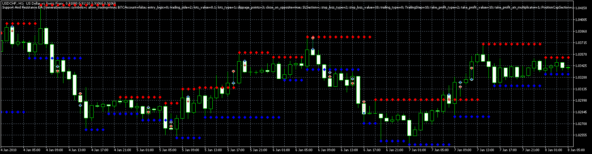

# Support And Resistance EA

> Source: https://fxcodebase.com/code/viewtopic.php?f=38&t=70534  
> Forum: 38 · Topic 70534 · 8 post(s)

---

## Support And Resistance EA

**Apprentice** · Tue Oct 13, 2020 6:25 am

Based on request.
[viewtopic.php?f=27&t=70527](https://fxcodebase.com/code/viewtopic.php?f=27&t=70527)

 [Support_and_Resistance.mq5](files/138253/Support_and_Resistance.mq5)

 [Support And Resistance EA.mq5](files/138253/Support%20And%20Resistance%20EA.mq5)

---

## Re: Support And Resistance EA

**Jailsonms** · Tue Oct 13, 2020 9:11 am

Hello apprentice, thank you for the quick response, I am sending images where some situations in the EA are not corresponding.

Thank you in advance.

---

## Re: Support And Resistance EA

**Apprentice** · Wed Oct 14, 2020 2:08 am

Your request is added to the development list.
Development reference 2187.

---

## Re: Support And Resistance EA

**Apprentice** · Thu Oct 15, 2020 1:15 am

You need to enable TP/SL/Trailing in the parameters if you want them to be set automatically.

---

## Re: Support And Resistance EA

**Jailsonms** · Sun Oct 18, 2020 5:13 pm

> **Apprentice wrote:**
> You need to enable TP/SL/Trailing in the parameters if you want them to be set automatically.

Hello apprentice, thanks for the help, I enabled it and it still didn't work Stop is not moving to the opening price.

---

## Re: Support And Resistance EA

**Apprentice** · Mon Oct 19, 2020 3:27 am

Your request is added to the development list.
Development reference 2200.

---

## Re: Support And Resistance EA

**Apprentice** · Sun Oct 25, 2020 9:25 am

It looks like some feature I don't understand.
Stop can't move the open price.

---

## Re: Support And Resistance EA

**Jailsonms** · Tue Oct 27, 2020 9:07 am

> **Apprentice wrote:**
> It looks like some feature I don't understand.
> Stop can't move the open price.

Yes, the stop is not moving, thank you for your help apprentice.
