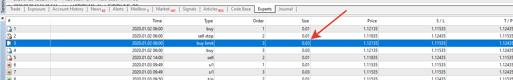

# surefire

> Source: https://fxcodebase.com/code/viewtopic.php?f=38&t=70204  
> Forum: 38 · Topic 70204 · 23 post(s)

---

## surefire

**Apprentice** · Tue Jul 21, 2020 8:48 am

Based on TS2 / Lua version.
[viewtopic.php?f=31&t=67358&start=10](https://fxcodebase.com/code/viewtopic.php?f=31&t=67358&start=10)

 [surefire.mq4](files/136170/surefire.mq4)

---

## Re: surefire

**tmue2014** · Wed Jul 22, 2020 6:55 am

Thanks a lot Apprentice!

---

## Re: surefire

**tmue2014** · Thu Jul 23, 2020 4:33 am

Hi Apprenctive,

on first test, it seems that the lot multiplication for subsequent orders is not done properly... sorry...

First order is buy with 0.1 lots, TP and all other parameters are correct but the corresponding Sell order is only 0.1 lots as well - it should be at least 3x bigger

Could u please check...

Thanks in advance

---

## Re: surefire

**Apprentice** · Thu Jul 23, 2020 9:12 am

Your request is added to the development list.
Development reference 1753.

---

## Re: surefire

**Apprentice** · Tue Jul 28, 2020 3:34 pm

I have no issues.

 

---

## Re: surefire

**Rcabrita47** · Wed Sep 09, 2020 10:13 am

> **Apprentice wrote:**
> I have no issues.
>
>
> image.png

Thanks for the share!! I was looking for this for a long time. But as as been said the lot multiplier is not working as is should, because the after opening the inicial position with 0.01 lot the pending order should be lot x3 already and after that 2x. This print shows the first position as 0.01 and the pending order is still 0.01 so like that its unsustainable. I’m looking forward for the fix. Thank you sir

---

## Re: surefire

**Apprentice** · Thu Sep 10, 2020 1:34 am

Your request is added to the development list.
Development reference 2007.

---

## Re: surefire

**Apprentice** · Thu Sep 10, 2020 4:56 am

I can't repeat that. It works as requested.

---

## Re: surefire

**tmue2014** · Thu Sep 17, 2020 10:47 pm

Dear Apprentice, I am really keen on seeing a working EA for this system.... Your time permitting, please have another look at the pdf for the system.....

See attached screenshot taken from pdf.... This system is basically a Martingale implementation and the pending order must always be 3x the combined lot size of the opened order(s) in the opposite direction in order to reach the TP within the given distances...

Thank you very much in advance

---

## Re: surefire

**Apprentice** · Fri Sep 18, 2020 2:55 am

Your request is added to the development list.
Development reference 2053.

---

## Re: surefire

**Apprentice** · Tue Sep 22, 2020 3:05 am

[surefire.mq4](files/137799/surefire.mq4)

I don't understand the logic required then

Can you provide pseudo-code of logic used?

---

## Re: surefire

**tmue2014** · Fri Sep 25, 2020 9:24 pm

Hi Apprentice,

I am not sure w/r the attachment qualifies as pseudo-code but the main issue, as far as I can tell, is that there is no Martingale implemented in any of your EAs for this concept....

Hope this helps....

---

## Re: surefire

**Apprentice** · Sun Sep 27, 2020 1:49 pm

Your request is added to the development list.
Development reference 2114.

---

## Re: surefire

**Apprentice** · Mon Oct 26, 2020 4:55 am

[Surefire_EA.mq4](files/138484/Surefire_EA.mq4)

Try this version.

---

## Re: surefire

**tmue2014** · Thu Nov 12, 2020 9:50 pm

Hi Apprentice, apologies for my late reply, but I was indisposed for a while....

I am a member for a couple of years now and have the greatest respect for your willingness & ability to entertain all the requests here in such professional manner but unfortunately not in this case.... I am not sure w/r this case is one of the coding projects that is farmed out to others but whoever is doing it is not reading the explanations...

Again, this version has no martingale after the first level and it doesnt reset to initial lot size after trade closure of open sequence..

I suggest we leave it at such and maybe you want to delete this thread as EA is not working as it should...

Cheers & keep up the good work!

---

## Re: surefire

**Apprentice** · Mon Dec 28, 2020 3:30 pm

[surefire.mq4](files/139842/surefire.mq4)

Try this version.

---

## Re: surefire

**tmue2014** · Mon Jan 04, 2021 8:51 pm

Hi Apprentice,

I am sorry but this implementation is three steps backwards, nothing like the brief.... EA shouldnt have SL, there is no opposite order, it doesnt have martingale.....

U can contact me by PM if u really want to code this, otherwise please drop...

Cheers

---

## Re: surefire

**Apprentice** · Tue Jan 05, 2021 8:29 am

Your request is added to the development list.
Development reference 31.

---

## Re: surefire

**Apprentice** · Wed Jan 06, 2021 11:44 am

Please, provide the version it should be based on

---

## Re: surefire

**tmue2014** · Wed Jan 06, 2021 10:26 pm

Hi Apprentice,

it should be based on the very first request here:
[viewtopic.php?f=27&t=67349](https://fxcodebase.com/code/viewtopic.php?f=27&t=67349)

and this is the complete description as provided by original requester:
[https://www.forexfactory.com/attachment ... 1350055718](https://www.forexfactory.com/attachment.php/1057341?attachmentid=1057341&d=1350055718)

Again, it seems that this concept is difficult to grasp, given that none of the EAs I found elsewhere actually trade the way it is described in above pdf.... maybe this concept doesnt even work due to martingale....

Cheers

---

## Re: surefire

**Apprentice** · Thu Jan 07, 2021 3:20 am

Your request is added to the development list.
Development reference 47.

---

## Re: surefire

**Apprentice** · Mon Jan 11, 2021 5:41 am

There is a lot of version of this strategy already implemented.
Please, specify or better yet upload the one you need.

---

## Re: surefire

**tmue2014** · Tue Jan 12, 2021 11:30 pm

Apprentice, as I have written several times, there are a lot of "implementation" but none I have tested so far follows the pdf document....

Seem too difficult, please drop development.....
