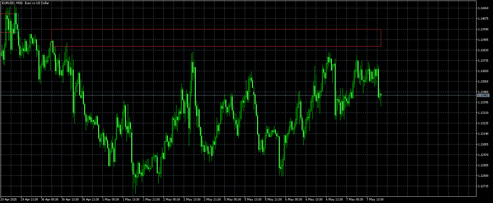
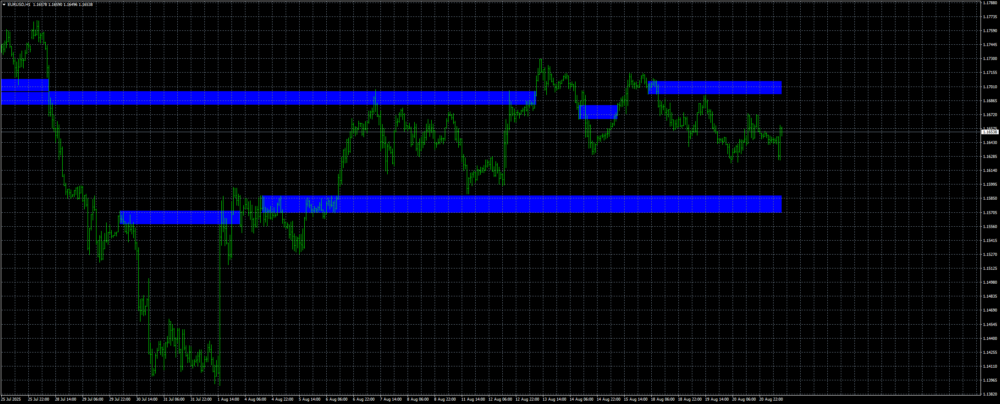
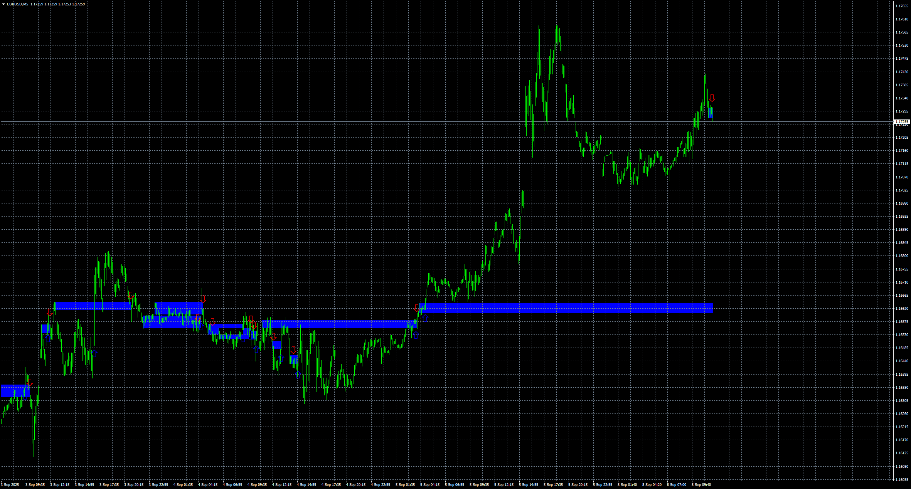

# Swing_Breakouts_Tests[LuxAlgo]

> Source: https://fxcodebase.com/code/viewtopic.php?f=38&t=75910  
> Forum: 38 · Topic 75910 · 13 post(s)

---

## Swing_Breakouts_Tests[LuxAlgo]

**Apprentice** · Wed May 07, 2025 11:17 am

Based on the request.
[https://fxcodebase.com/code/viewtopic.p ... 66#p156266](https://fxcodebase.com/code/viewtopic.php?f=27&p=156266#p156266)

 [Swing_Breakouts_Tests(LuxAlgo).mq5](files/159144/Swing_Breakouts_TestsLuxAlgo.mq5)

---

## Re: Swing_Breakouts_Tests[LuxAlgo]

**marcelo2k9** · Fri Aug 01, 2025 2:41 pm

Please Sir can we have the mt4 version thanks alot

---

## Re: Swing_Breakouts_Tests[LuxAlgo]

**Apprentice** · Mon Aug 04, 2025 4:24 am

We have added your request to the development list.
Development reference 488

---

## Re: Swing_Breakouts_Tests[LuxAlgo]

**khanatd** · Fri Aug 08, 2025 1:56 am

sir can we have mt4 version of it? thanks

---

## Re: Swing_Breakouts_Tests[LuxAlgo]

**khanatd** · Sat Aug 16, 2025 1:14 am

hi sir plz reminder

---

## Re: Swing_Breakouts_Tests[LuxAlgo]

**Apprentice** · Thu Aug 21, 2025 3:25 am

 [Breakouts_with_Tests_&_Retests_(LuxAlgo).mq4](files/160301/Breakouts_with_Tests__Retests_LuxAlgo.mq4)

---

## Re: Swing_Breakouts_Tests[LuxAlgo]

**khanatd** · Thu Aug 21, 2025 3:01 pm

Hi sir thanks a lot, indicator is missing arrows, plz add them where conditions of indicator meet,

thanks a lot
khan

---

## Re: Swing_Breakouts_Tests[LuxAlgo]

**khanatd** · Thu Aug 21, 2025 10:12 pm

Hi sir plz add arrows too, thanks

---

## Re: Swing_Breakouts_Tests[LuxAlgo]

**Apprentice** · Mon Aug 25, 2025 2:37 am

We have added your request to the development list.
Development reference 538

---

## Re: Swing_Breakouts_Tests[LuxAlgo]

**Apprentice** · Mon Sep 08, 2025 3:57 am

 [Breakouts_with_Tests_5BLuxAlgo2Barrow.mq4](files/160490/Breakouts_with_Tests_5BLuxAlgo2Barrow.mq4)

---

## Re: Swing_Breakouts_Tests[LuxAlgo]

**alema0** · Mon Sep 22, 2025 1:43 pm

> **Apprentice wrote:**
>
>
> eurusd-m5-stratos-trading-pty.png
>
>
>
>
> Breakouts_with_Tests_5BLuxAlgo2Barrow.mq4

Please add buffers for buy and sell arrows.. THX

---

## Re: Swing_Breakouts_Tests[LuxAlgo]

**Apprentice** · Tue Sep 23, 2025 3:09 am

We have added your request to the development list.
Development reference 597

---

## Re: Swing_Breakouts_Tests[LuxAlgo]

**Apprentice** · Sat Sep 27, 2025 3:37 pm

[Breakouts_with_Tests_5BLuxAlgo2Barrow_v2.mq4](files/160637/Breakouts_with_Tests_5BLuxAlgo2Barrow_v2.mq4)

Try this version.
