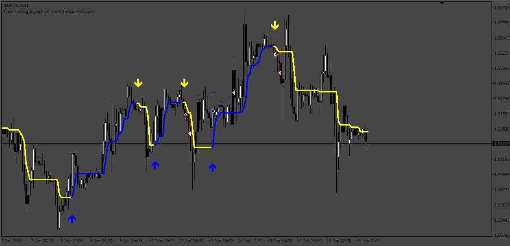
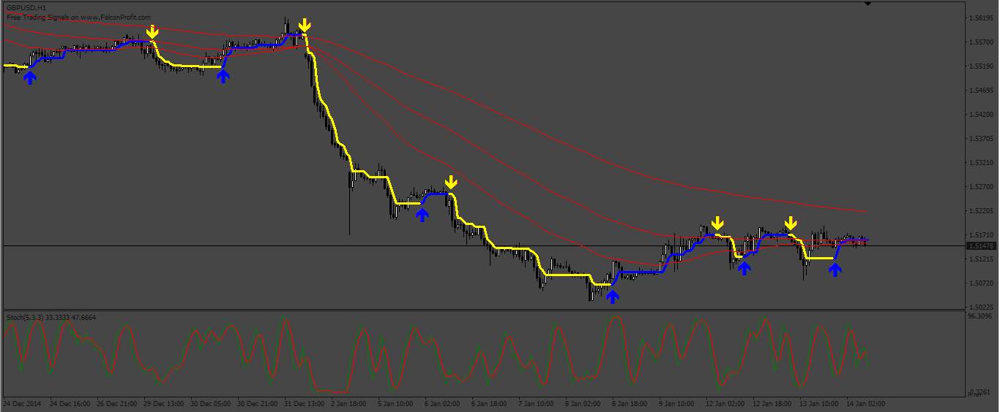

# Swing_Catcher_EA

> Source: https://fxcodebase.com/code/viewtopic.php?f=38&t=73662  
> Forum: 38 · Topic 73662 · 6 post(s)

---

## Swing_Catcher_EA

**Apprentice** · Mon May 01, 2023 3:38 am

Based on the request.
[https://fxcodebase.com/code/viewtopic.php?f=38&t=73630](https://fxcodebase.com/code/viewtopic.php?f=38&t=73630)

 [03-Swing_Catcher.ex4](files/150629/03-Swing_Catcher.ex4)

 [Swing_Catcher_EA.mq4](files/150629/Swing_Catcher_EA.mq4)

---

## Re: Swing_Catcher_EA

**Martosin2** · Thu May 04, 2023 6:14 am

Hello Author,
Please can you kindly add **Moving Averages (MA) 50, 100 and 200 And STOCHASTICS (80/20 Levels)** in the Settings of this EA?

So that one can simply activate it in the settings.

Also, I am finding it difficult to properly setup the Trailing Stop to move up 4 pips as price progresses. An idea on how to do this will be most appreciated.

Thanks a lot.

---

## Re: Swing_Catcher_EA

**Apprentice** · Sat May 13, 2023 10:26 am

 [Swing_Catcher_EA_v2.mq4](files/150816/Swing_Catcher_EA_v2.mq4)

---

## Re: Swing_Catcher_EA

**Martosin2** · Fri Jun 16, 2023 6:35 pm

> **Apprentice wrote:**
>
>
> 413pic.png
>
>
>
>
> Swing_Catcher_EA_v2.mq4

Admin, thank you so much for a job well done. Sorry reply is coming a little late. Much apprecaited. Thanks

---

## Re: Swing_Catcher_EA

**Martosin2** · Fri Jun 16, 2023 6:59 pm

> **Apprentice wrote:**
>
>
> 413pic.png
>
>
>
>
> Swing_Catcher_EA_v2.mq4

Admin, can you please convert this to MT5 version as well and re-attach?
It should please include the MT5 Source file and MT5 Program file so it can attach to my charts.

And I don't know if this EA can be programmed to take BUY trades when the MAs are in an up direction and SELL trades when downtrend?

Thanks a lot as I await your response.

---

## Re: Swing_Catcher_EA

**Apprentice** · Wed Jun 21, 2023 9:40 am

We have added your request to the development list.
Development reference 550.
