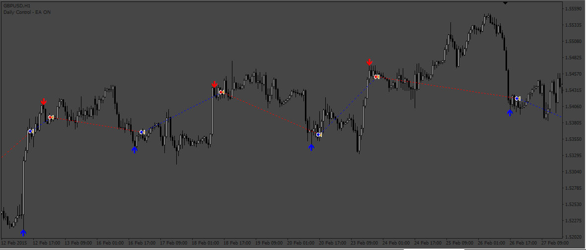
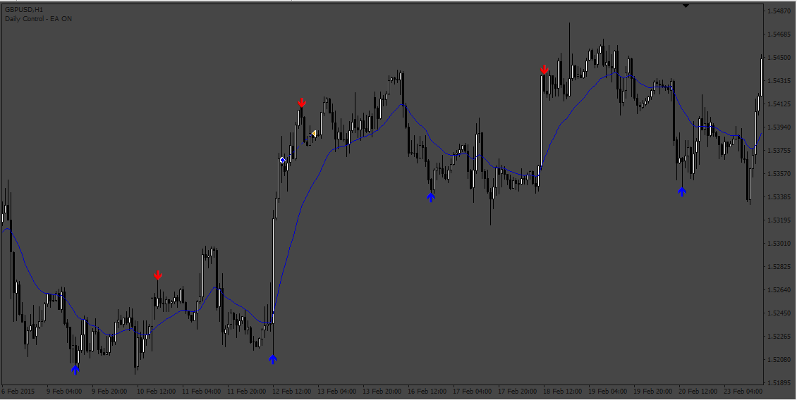

# Swing_EA

> Source: https://fxcodebase.com/code/viewtopic.php?f=38&t=73753  
> Forum: 38 · Topic 73753 · 5 post(s)

---

## Swing_EA

**Apprentice** · Sat May 20, 2023 2:07 am

Based on the request.
[https://fxcodebase.com/code/viewtopic.php?f=27&p=150800](https://fxcodebase.com/code/viewtopic.php?f=27&p=150800)

 [Swing_Indicator.mq4](files/150931/Swing_Indicator.mq4)

 [Swing_EA.mq4](files/150931/Swing_EA.mq4)

---

## Re: Swing_EA

**ACast2022** · Fri May 26, 2023 3:23 pm

Admin. Could you please add a moving average to this EA.

Moving average (true/false)

If true, you put the data of the moving average, in the settings, and then, above moving average selected, only take buy positions, below only take sell positions.

Thanks!

---

## Re: Swing_EA

**Apprentice** · Wed May 31, 2023 2:16 pm

We have added your request to the development list.
Development reference 499.

---

## Re: Swing_EA

**Apprentice** · Sun Jun 04, 2023 2:53 am

Try this version.

 [Swing_EA_v2.mq4](files/151104/Swing_EA_v2.mq4)

---

## Re: Swing_EA

**ACast2022** · Mon Jun 05, 2023 2:55 pm

Thank you very much!
