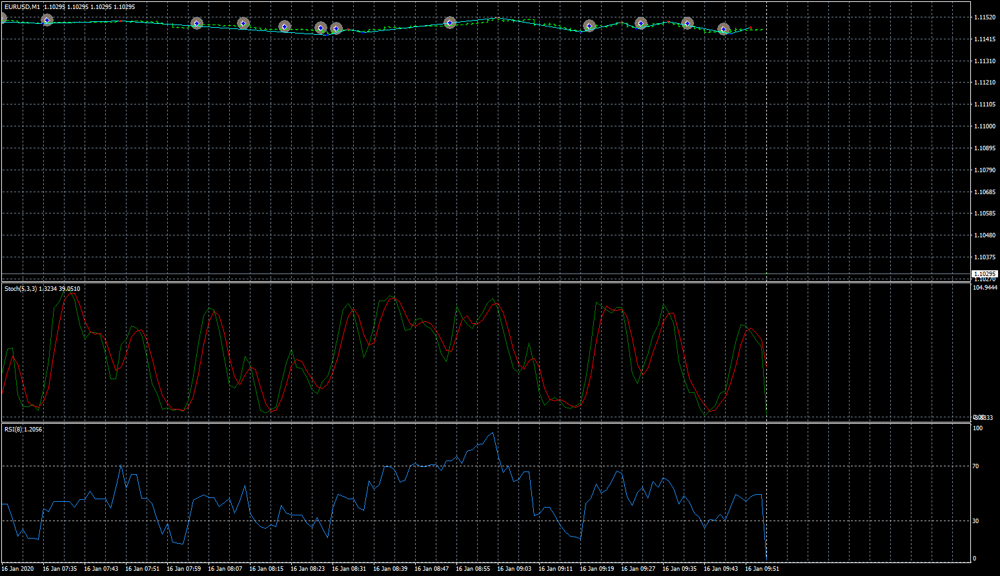

# Swing EA

> Source: https://fxcodebase.com/code/viewtopic.php?f=38&t=70616  
> Forum: 38 · Topic 70616 · 4 post(s)

---

## Swing EA

**Apprentice** · Wed Nov 11, 2020 2:49 pm

Based on request.
[viewtopic.php?f=27&t=70608](https://fxcodebase.com/code/viewtopic.php?f=27&t=70608)

 [Swing_ZZ.mq4](files/138813/Swing_ZZ.mq4)

 [Swing EA.mq4](files/138813/Swing%20EA.mq4)

---

## Re: Swing EA

**taipan** · Thu Nov 12, 2020 10:43 pm

Hi Mario,

There is a lot of errors:

Swing EA GBPAUD,H1: Invalid stop loss or take profit in the request.

please fix.

cheer,
taipan

---

## Re: Swing EA

**Apprentice** · Fri Nov 13, 2020 3:31 am

Your request is added to the development list.
Development reference 2302.

---

## Re: Swing EA

**Apprentice** · Sun Nov 15, 2020 4:37 am

It's a setup issue. It's likely that you have selected an invalid stop loss/take profit or broker type.
