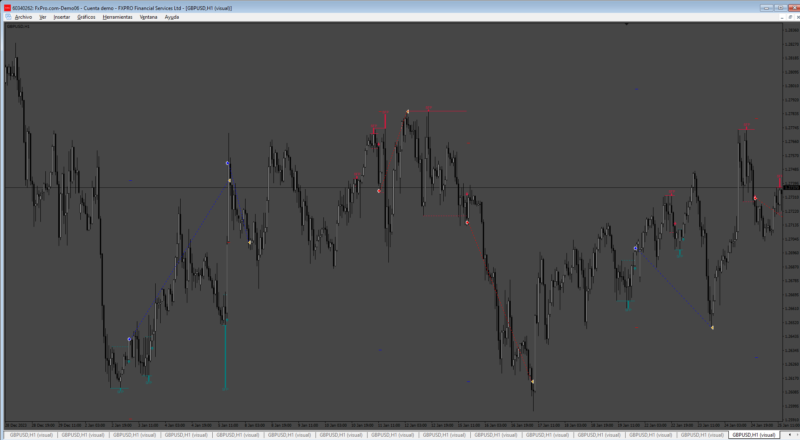

# Swing_Failure_EA

> Source: https://fxcodebase.com/code/viewtopic.php?f=38&t=76105  
> Forum: 38 · Topic 76105 · 4 post(s)

---

## Swing_Failure_EA

**Apprentice** · Sun Jun 29, 2025 2:19 pm

Based on the request.
[https://fxcodebase.com/code/viewtopic.p ... 88#p159688](https://fxcodebase.com/code/viewtopic.php?f=27&p=159688#p159688)

 [LuxAlgo_-_Swing_Failure_Pattern.ex4](files/159785/LuxAlgo_-_Swing_Failure_Pattern.ex4)

 [Swing_Failure_EA.mq4](files/159785/Swing_Failure_EA.mq4)

---

## Re: Swing_Failure_EA

**andrewtrading** · Mon Jun 30, 2025 1:44 pm

Why doesn't it work? like ea doesn't call up buffers or indicator (i think it doesn't call up indicator) i set the correct name but nothing

---

## Re: Swing_Failure_EA

**Apprentice** · Wed Jul 02, 2025 2:32 pm

We have added your request to the development list.
Development reference 426

---

## Re: Swing_Failure_EA

**Apprentice** · Mon Jul 07, 2025 4:32 pm

[44471](files/159859/image.png)

The indicator doesn't use buffers, so you need to place it on the chart, and the EA will read the objects it draws."
