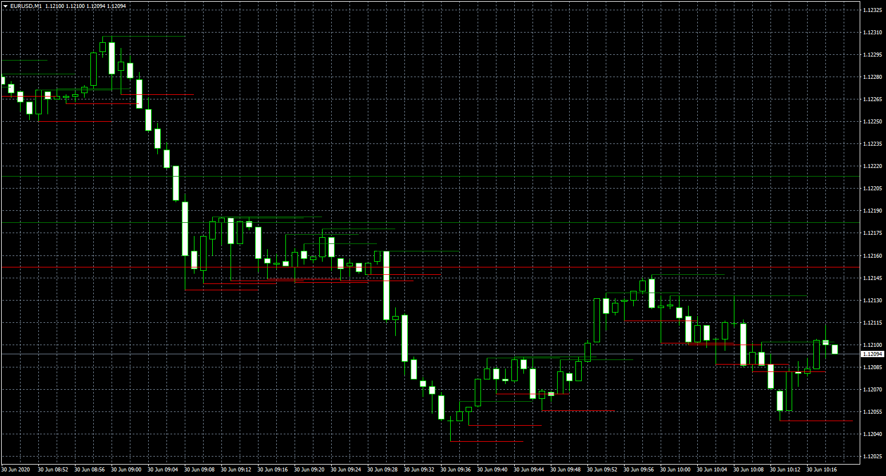

# Swing High Low

> Source: https://fxcodebase.com/code/viewtopic.php?f=38&t=70103  
> Forum: 38 · Topic 70103 · 4 post(s)

---

## Swing High Low

**Apprentice** · Tue Jun 30, 2020 4:05 am

Based on request.
[viewtopic.php?f=27&t=70095](https://fxcodebase.com/code/viewtopic.php?f=27&t=70095)

 [Swing High Low.mq4](files/135441/Swing%20High%20Low.mq4)

---

## Re: Swing High Low

**SANTOSH** · Wed Jul 20, 2022 8:58 am

Can this be done for fxcm lua ?

---

## Re: Swing High Low

**Apprentice** · Wed Jul 20, 2022 10:52 am

We have added your request to the development list.
Development reference 438.

---

## Re: Swing High Low

**Apprentice** · Tue Aug 15, 2023 12:00 pm

You can try this version: [viewtopic.php?f=17&t=23506](https://fxcodebase.com/code/viewtopic.php?f=17&t=23506)
