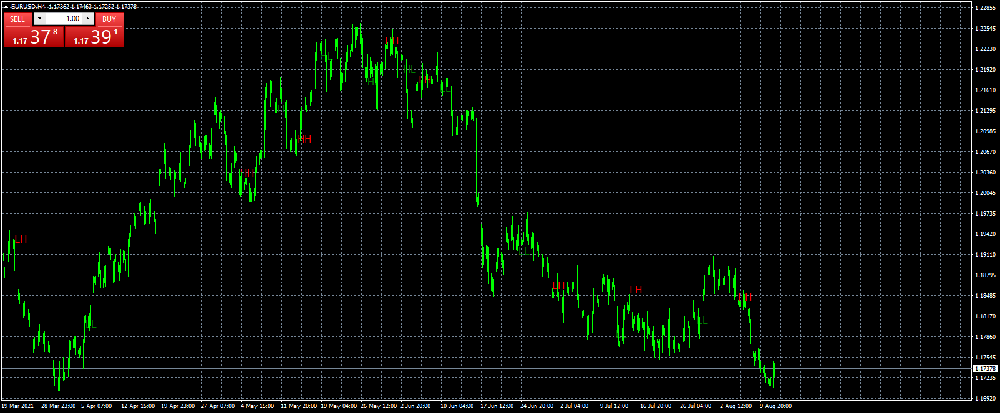

# Swing_Highs-Lows_&_Candle_Patterns

> Source: https://fxcodebase.com/code/viewtopic.php?f=38&t=71413  
> Forum: 38 · Topic 71413 · 1 post(s)

---

## Swing_Highs-Lows_&_Candle_Patterns

**Apprentice** · Wed Aug 11, 2021 10:17 am

TS2 version
[https://fxcodebase.com/code/viewtopic.php?f=17&t=71378](https://fxcodebase.com/code/viewtopic.php?f=17&t=71378)

 [Swing_Highs-Lows_&_Candle_Patterns.mq4](files/143187/Swing_Highs-Lows__Candle_Patterns.mq4)
