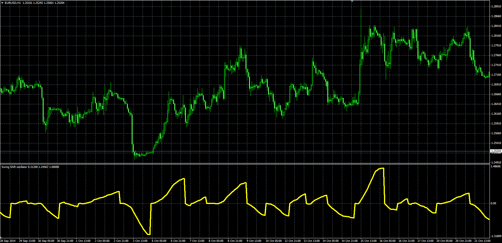

# Swing Shift

> Source: https://fxcodebase.com/code/viewtopic.php?f=38&t=61471  
> Forum: 38 · Topic 61471 · 1 post(s)

---

## Swing Shift

**Alexander.Gettinger** · Tue Nov 18, 2014 12:22 pm

Original LUA oscillator: [viewtopic.php?f=17&t=16214](https://fxcodebase.com/code/viewtopic.php?f=17&t=16214).

> This indicator shows the percentage change from Swing, High / Low.
> There are two modes.
> Cumulative-sum of all percentage changes.
> Absolute - Change from last Swong Low / High.

 

Download:

 [SS2.mq4](files/97167/SS2.mq4)
