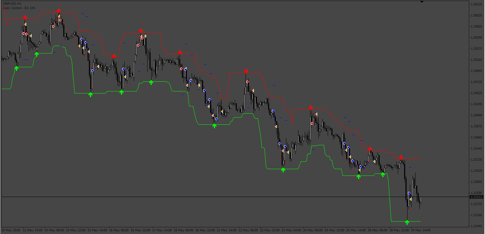
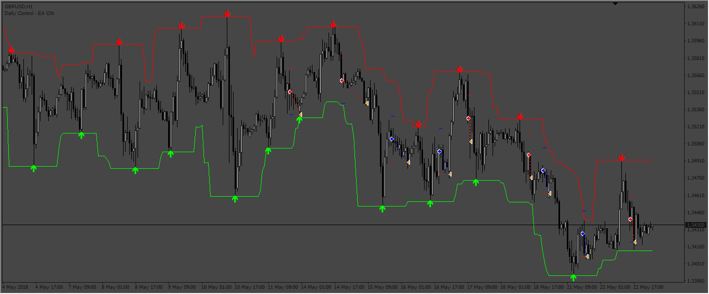

# Swing-Trading-buy-sell EA

> Source: https://fxcodebase.com/code/viewtopic.php?f=38&t=72745  
> Forum: 38 · Topic 72745 · 7 post(s)

---

## Swing-Trading-buy-sell EA

**Apprentice** · Fri Sep 23, 2022 9:59 am

Based on the request.
[https://fxcodebase.com/code/viewtopic.php?f=38&t=72705](https://fxcodebase.com/code/viewtopic.php?f=38&t=72705)

 [swing-trading-buy-sell-indicator.ex4](files/147543/swing-trading-buy-sell-indicator.ex4)

 [Swing-Trading-buy-sell EA.mq4](files/147543/Swing-Trading-buy-sell%20EA.mq4)

---

## Re: Swing-Trading-buy-sell EA

**Vatson12** · Fri Sep 23, 2022 11:44 am

Hello. Is it possible to add to the Expert Advisor the function of opening an order with the arrow of the indicator and closing with the opposite arrow of the indicator?

---

## Re: Swing-Trading-buy-sell EA

**Apprentice** · Mon Sep 26, 2022 3:09 am

EA was updated.

---

## Re: Swing-Trading-buy-sell EA

**Sensible** · Fri Sep 30, 2022 4:39 am

Hi the Fxcodebase teams,

 My sincere appreciation to the team of fxcodebase.com for creating EA out of this indicator for me. Thanks so much I am grateful. But my little challenge now is that I have a little challenge with the working of this EA giving me some lost trade and the fault is totally from me.

 Reason is that when I was looking for good indicator to use to make an EA that will give me good win and less lost. I was carried away with the diagram illustration of this Swing-Trading-buy-sell indicator and not bother to tested the working of it before sending it for EA Request but while waiting for it I decided to run it on Demo account then I discovered that the arrow keep shifting to the next price each time the price touches the band.

For example: let say the price is on Long position (Open Buy) and it keep swinging up to red band and it touches it, a red arrow appear indicating Short position (Open Sell) and the next price touches the band again the arrow move from previous to the current and it can occur many times before it finally reverse. it happen on both long and short position.

I don't know what you can help me to do to it maybe you can help me apply Shift2 to closing and opening a trade or wait 2 candlestick closed before action. i.e the current price running will be shift0 while the precious closed will be shift1 while the one the arrow appeared on will be shift2 and that is where I want the action of close and open trade should occur. or if there is any better way to do it since you're the expert in the field.

I will appreciate any correction on it.

Thanks in advance.

---

## Re: Swing-Trading-buy-sell EA

**Sensible** · Wed Oct 05, 2022 6:51 am

Good day Admin,

 I am still waiting for your respond on the correction of this EA (Swing-Trading-buy-sell EA) to be added to development or have you update.

Thanks in advance.

---

## Re: Swing-Trading-buy-sell EA

**Apprentice** · Thu Oct 06, 2022 2:29 pm

We have added your request to the development list.
Development reference 628.

---

## Re: Swing-Trading-buy-sell EA

**Apprentice** · Tue Oct 18, 2022 1:43 am

This version has the param "Candles to confirm signal" to try to filter bad signals.
The idea is if the indicator signal is still there before "x" candles, so the signal is a good signal.

 [Swing-Trading-buy-sell_EA.mq4](files/147945/Swing-Trading-buy-sell_EA.mq4)
