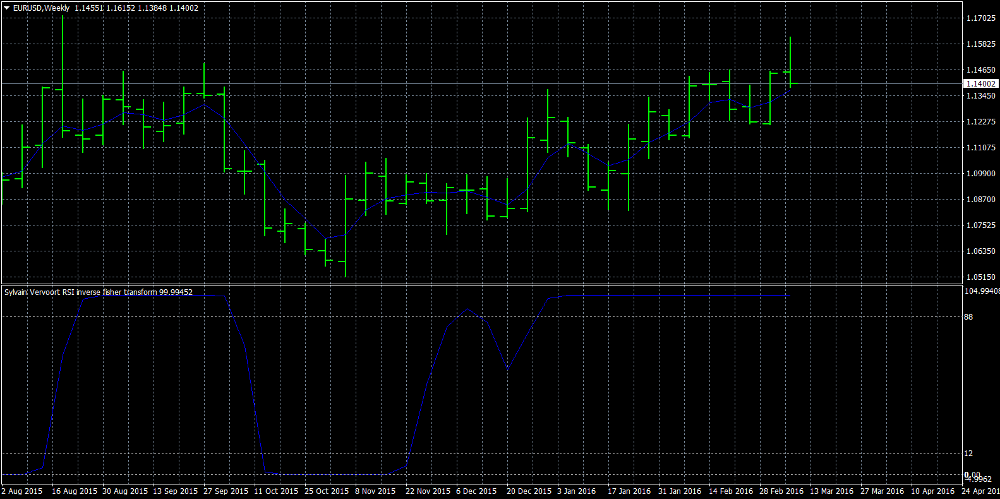

# Sylvain Vervoort's Smoothed RSI Inverse Fisher Transform

> Source: https://fxcodebase.com/code/viewtopic.php?f=38&t=63454  
> Forum: 38 · Topic 63454 · 1 post(s)

---

## Sylvain Vervoort's Smoothed RSI Inverse Fisher Transform

**Apprentice** · Sun May 08, 2016 12:18 pm

Sylvain Vervoort's Smoothed RSI Inverse Fisher Transform indicator is described in October 2010 issue of Stocks & Commodities.

 [Sylvain Vervoort rainbow moving average.mq4](files/106160/Sylvain%20Vervoort%20rainbow%20moving%20average.mq4)

 [Sylvain Vervoort RSI inverse fisher transform.mq4](files/106160/Sylvain%20Vervoort%20RSI%20inverse%20fisher%20transform.mq4)

TS2 / Marketscope version is available here.
