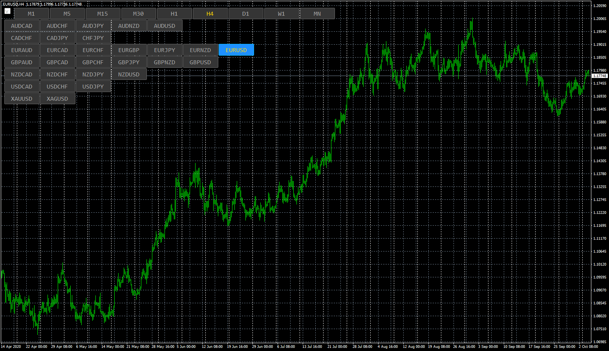

# Symbol_changer

> Source: https://fxcodebase.com/code/viewtopic.php?f=38&t=70596  
> Forum: 38 · Topic 70596 · 5 post(s)

---

## Symbol_changer

**Apprentice** · Thu Nov 05, 2020 3:50 am

Based on request.
[viewtopic.php?f=27&t=70556](https://fxcodebase.com/code/viewtopic.php?f=27&t=70556)

 [Symbol_changer.mq4](files/138666/Symbol_changer.mq4)

---

## Re: Symbol_changer

**richard19** · Thu Nov 05, 2020 10:01 am

HI Mario

Thank you so much. It works perfectly

Sure, a lot of guys are going to love this.

regards
richard.

---

## Re: Symbol_changer

**syncoopate** · Thu Dec 10, 2020 2:06 pm

nice utility Mario, but i tried to use several times on the same chart but it doesn't work .... i tried to change ID but it doesn't work ..... is it possible to fix? it would be convenient to be able to group forex ... indices ... commodities ... energy ..
Thanks Mario for what you do ...

---

## Re: Symbol_changer

**Apprentice** · Fri Dec 11, 2020 4:01 am

I do not have any problem.
What are your experiences?

---

## Re: Symbol_changer

**clavez** · Mon Dec 14, 2020 11:56 pm

Beautiful work.
Thank you
