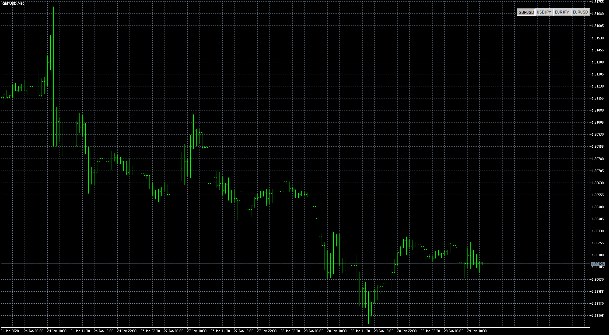
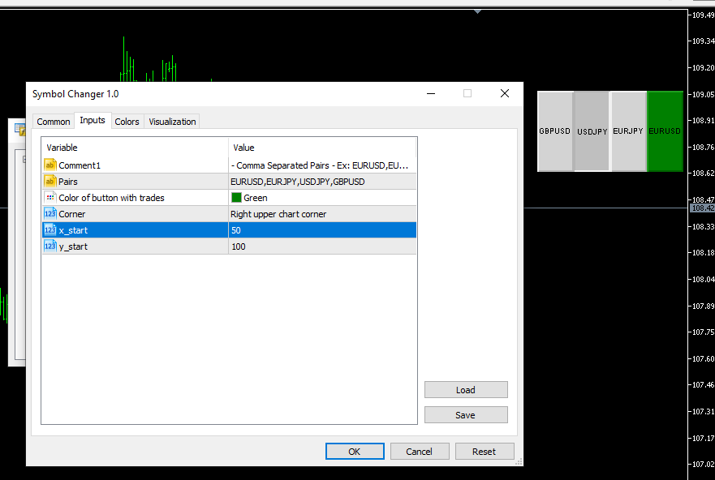

# Symbol Changer

> Source: https://fxcodebase.com/code/viewtopic.php?f=38&t=69358  
> Forum: 38 · Topic 69358 · 5 post(s)

---

## Symbol Changer

**Apprentice** · Wed Jan 29, 2020 7:51 am

Symbol Changer will allow you to change the instrument with simple button click.

 [Symbol Changer.mq5](files/130962/Symbol%20Changer.mq5)

---

## Re: Symbol Changer

**mediprana** · Mon Mar 30, 2020 12:08 pm

> **Apprentice wrote:**
>
>
> gbpusd-m30-metaquotes-software-corp-3.png
>
>
> Symbol Changer will allow you to change the instrument with simple button click.
>
>
> Symbol Changer.mq5

Thanks Mario, this is very useful.

---

## Re: Symbol Changer

**mediprana** · Sat Apr 11, 2020 7:45 am

Hi Mario, I try to change the y start and turn out it change the width of indicator. Is this normal?

---

## Re: Symbol Changer

**Apprentice** · Mon Apr 20, 2020 7:44 am

[Symbol Changer.mq5](files/132981/Symbol%20Changer.mq5)

Try this version.

---

## Re: Symbol Changer

**mediprana** · Thu Apr 23, 2020 1:51 pm

Great Mario, it work good now.
