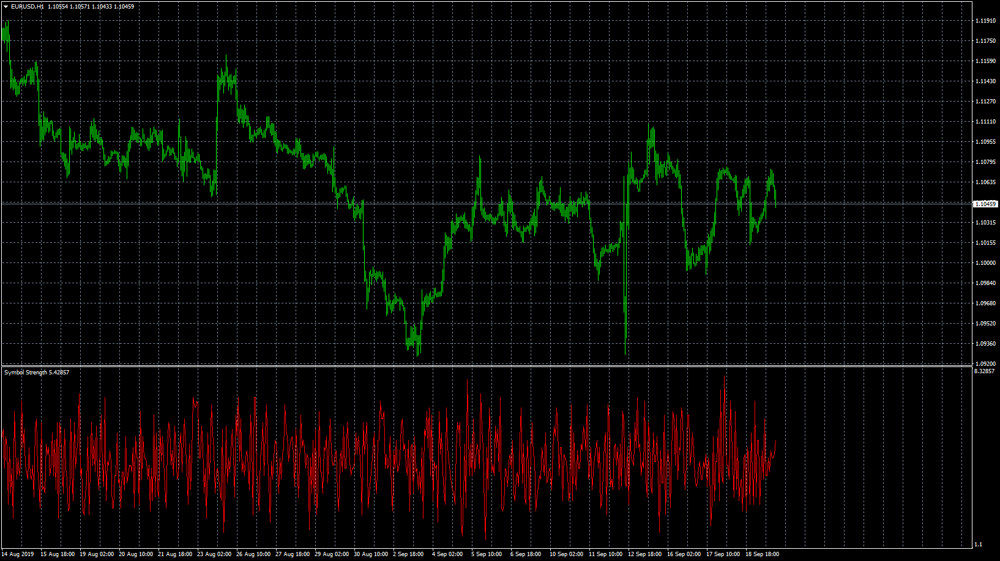
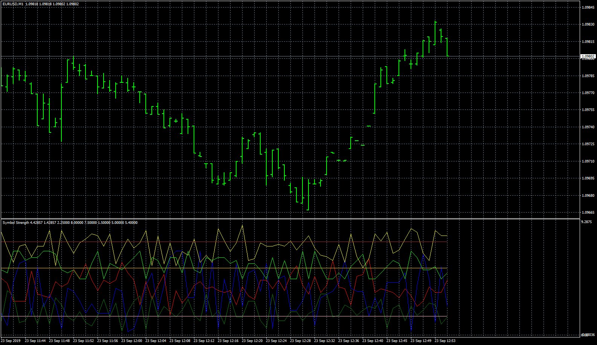

# Symbol_Strength

> Source: https://fxcodebase.com/code/viewtopic.php?f=38&t=68939  
> Forum: 38 · Topic 68939 · 4 post(s)

---

## Symbol_Strength

**Apprentice** · Thu Sep 19, 2019 12:51 pm

Based on request.
[viewtopic.php?f=27&t=68923](https://fxcodebase.com/code/viewtopic.php?f=27&t=68923)

 [Symbol_Strength.mq4](files/128778/Symbol_Strength.mq4)

 

 [Multi Symbol_Strength.mq4](files/128778/Multi%20Symbol_Strength.mq4)

---

## Re: Symbol_Strength

**logicgate** · Wed Oct 09, 2019 4:44 pm

Thanks buddy,

I am sorry I didn´t request this earlier but this indicator is one of those which would benefit from having a multifimeframe option so you can choose which one to display.

---

## Re: Symbol_Strength

**Apprentice** · Thu Oct 10, 2019 12:24 pm

Your request is added to the development list.
Development reference 171.

---

## Re: Symbol_Strength

**Apprentice** · Fri Oct 11, 2019 10:40 am

[Multi_Time_Frame_Multi_Symbol_Strength.mq4](files/129159/Multi_Time_Frame_Multi_Symbol_Strength.mq4)

Try this version.
