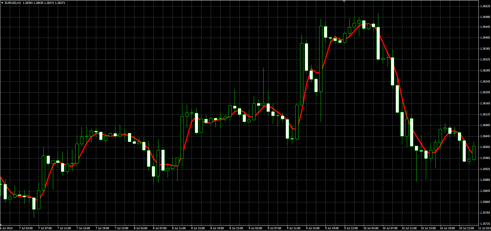

# Symmetrically weighted FIR filter

> Source: https://fxcodebase.com/code/viewtopic.php?f=38&t=61257  
> Forum: 38 · Topic 61257 · 1 post(s)

---

## Symmetrically weighted FIR filter

**Alexander.Gettinger** · Thu Sep 25, 2014 9:52 am

Original LUA indicator: [viewtopic.php?f=17&t=26681](https://fxcodebase.com/code/viewtopic.php?f=17&t=26681).

Formula:
Fif[i] = (Price[i]+2*Price[i-1]+2*Price[i-2]+Price[i-3])/6.

 

Download:

 [Fif.mq4](files/96203/Fif.mq4)
