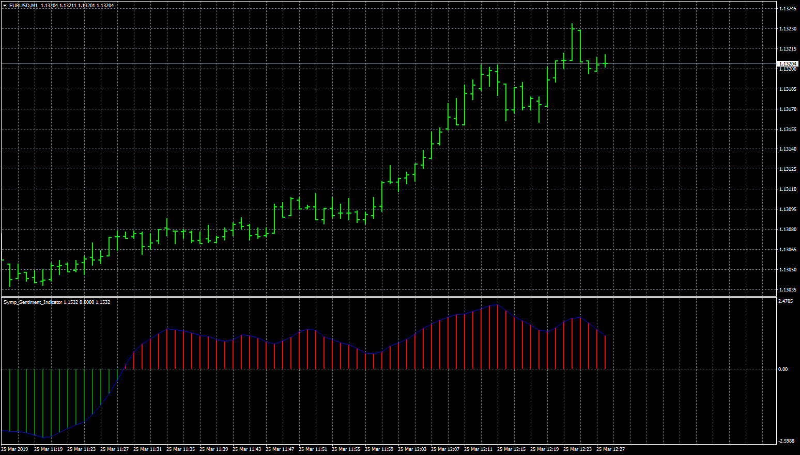

# Symp Sentiment Indicator

> Source: https://fxcodebase.com/code/viewtopic.php?f=38&t=68168  
> Forum: 38 · Topic 68168 · 1 post(s)

---

## Symp Sentiment Indicator

**Apprentice** · Mon Mar 25, 2019 9:25 am

Formula:
Symp_Sentiment[i]=(Ln((1+St[i])/(1-St[i]))+Symp_Sentiment[i-1])/2, where
Ln() - natural logarithm,
St[i]=0.66*((Median[i]-Min)/(Max-Min)-0.5)+0.67*St[i-1],
Max and Min are a maximum and minimum prices at range from [i-Period] to [i].

 [Symp_Sentiment_Indicator.mq4](files/125306/Symp_Sentiment_Indicator.mq4)

TS/JavaScript version.
[viewtopic.php?f=48&t=64745#p112756](https://fxcodebase.com/code/viewtopic.php?f=48&t=64745#p112756)
