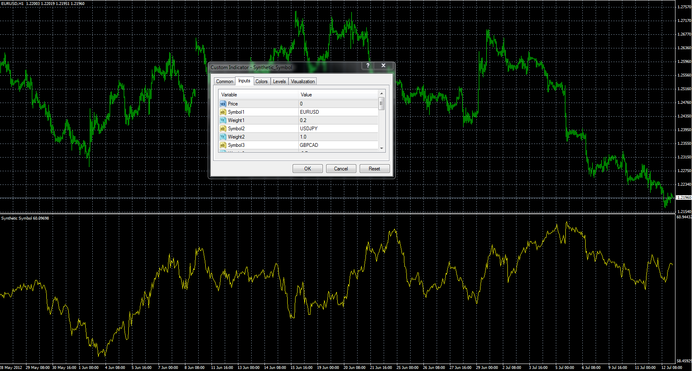
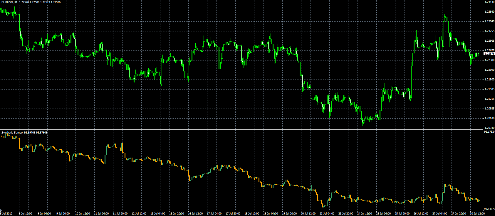

# Synthetic Symbol indicator.

> Source: https://fxcodebase.com/code/viewtopic.php?f=38&t=21016  
> Forum: 38 · Topic 21016 · 2 post(s)

---

## Synthetic Symbol indicator.

**Alexander.Gettinger** · Thu Jul 12, 2012 4:40 pm

Indicator calculate synthetic symbol currency against a basket of currencies.
For EUR/USD, USD/JPY, GBP/USD, USD/CAD, USD/SEK, USD/CHF with their weightes can be calculated US dollar index ([viewtopic.php?f=38&t=20873](https://fxcodebase.com/code/viewtopic.php?f=38&t=20873)).

 

Download:

 [Synthetic_Symbol.mq4](files/36824/Synthetic_Symbol.mq4)

---

## Re: Synthetic Symbol indicator.

**Alexander.Gettinger** · Mon Jul 30, 2012 3:17 pm

Synthetic symbol candle indicator.

 

Download:

 [Synthetic_Symbol_Candles.mq4](files/37699/Synthetic_Symbol_Candles.mq4)
