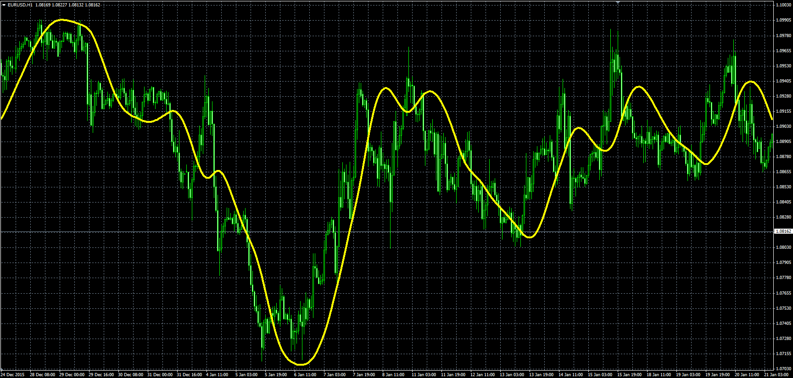

# T3 moving average by T.Tillson

> Source: https://fxcodebase.com/code/viewtopic.php?f=38&t=63063  
> Forum: 38 · Topic 63063 · 3 post(s)

---

## T3 moving average by T.Tillson

**Alexander.Gettinger** · Mon Jan 25, 2016 9:10 am

The indicator is the T3 moving average by T.Tillson.

Formula:
T3[i]=DEMA(i,DEMA2), where
DEMA2[i]=DEMA(i,DEMA1),
DEMA1[i]=DEMA(i,Price),
DEMA - Double Exponential Moving Average

 

Download:

 [T3_MA.mq4](files/104416/T3_MA.mq4)

---

## Re: T3 moving average by T.Tillson

**LeTigre30** · Fri Apr 08, 2016 9:58 am

Hi Alexander,

Is it possible to have this indicator translated for the TS2 ?

I know, it is included in Averages. lua, but this is too heavy in terms of bytes weight.

I would have this indicator alone ...

Bst Rgds,

LeTigre30

---

## Re: T3 moving average by T.Tillson

**Apprentice** · Fri May 06, 2016 3:28 am

Try this versions.
[viewtopic.php?f=17&t=62129&p=99932&hilit=Tillson#p99932](https://fxcodebase.com/code/viewtopic.php?f=17&t=62129&p=99932&hilit=Tillson#p99932)
[viewtopic.php?f=17&t=1302&p=2487&hilit=Tillson#p2487](https://fxcodebase.com/code/viewtopic.php?f=17&t=1302&p=2487&hilit=Tillson#p2487)
