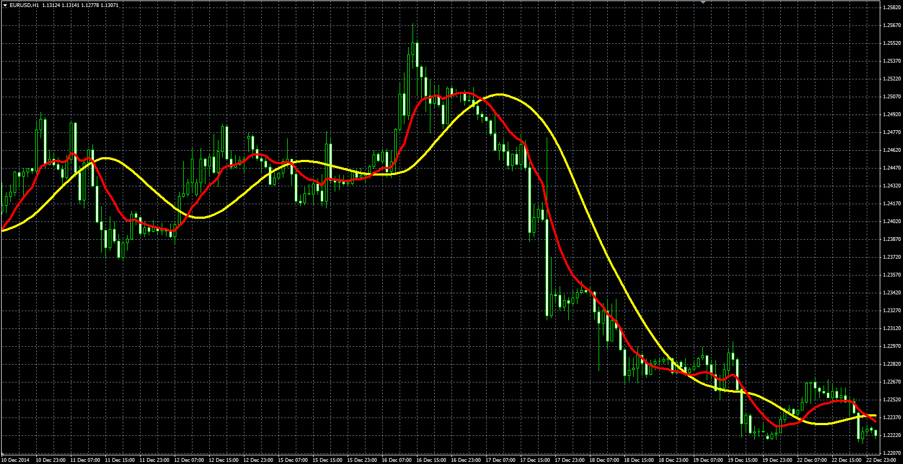

# T3 moving average & Generalized DEMA

> Source: https://fxcodebase.com/code/viewtopic.php?f=38&t=61849  
> Forum: 38 · Topic 61849 · 1 post(s)

---

## T3 moving average & Generalized DEMA

**Alexander.Gettinger** · Fri Feb 20, 2015 5:38 pm

Original LUA indicators: [viewtopic.php?f=17&t=1302&p=2496#p2487](https://fxcodebase.com/code/viewtopic.php?f=17&t=1302&p=2496#p2487).

**Generalized DEMA:**

Formula:
GD = (1+VF)*EMA1-VF*EMA2, where
EMA2 - EMA(EMA1) with [Length] number of periods,
EMA1 - EMA(Price) with [Length] number of periods.

**T3 moving average:**

Formula:
T3 = (1+VF)*EMA4-VF*EMA5, where
EMA5 - EMA(EMA4) with [Length] number of periods,
EMA4 - EMA(GD2) with [Length] number of periods,
GD2 = (1+VF)*EMA2-VF*EMA3,
EMA3 - EMA(EMA2) with [Length] number of periods,
EMA2 - EMA(GD) with [Length] number of periods,
GD = (1+VF)*EMA0-VF*EMA1,
EMA1 - EMA(EMA0) with [Length] number of periods,
EMA0 - EMA(Price) with [Length] number of periods.

 

Download:

 [GD.mq4](files/98764/GD.mq4)

 [T3.mq4](files/98764/T3.mq4)
