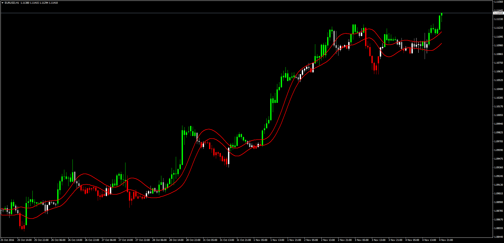

# T3 Price Overlay

> Source: https://fxcodebase.com/code/viewtopic.php?f=38&t=64060  
> Forum: 38 · Topic 64060 · 1 post(s)

---

## T3 Price Overlay

**Apprentice** · Sat Nov 05, 2016 4:48 am

T3 Price Overlay

LUA Original: [viewtopic.php?f=17&t=2217](https://fxcodebase.com/code/viewtopic.php?f=17&t=2217)

Description:

This indicator colors the candle Green when the Close is above the T3 Moving Average calculated for the Price High, and Red for the opposite escenario.

The T3 calculations have been coded inside, so it means no other indicator is needed.

 [T3_Price_Overlay.mq4](files/108926/T3_Price_Overlay.mq4)
