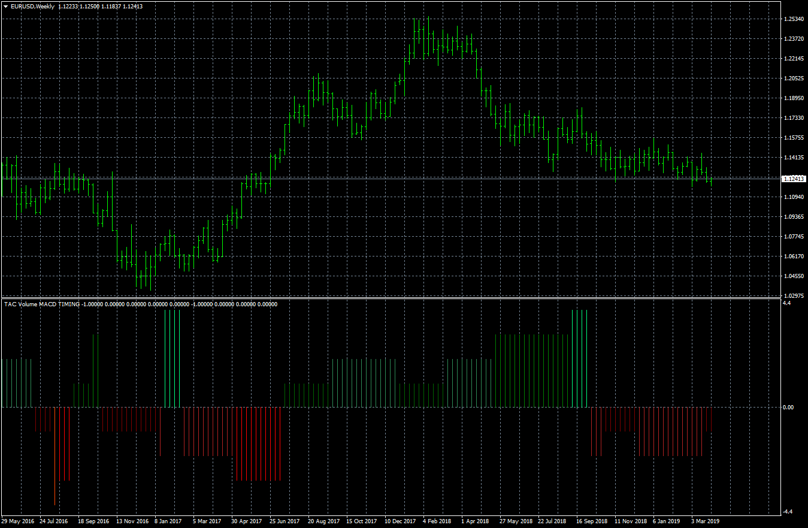

# TAC Volume MACD TIMING

> Source: https://fxcodebase.com/code/viewtopic.php?f=38&t=68298  
> Forum: 38 · Topic 68298 · 1 post(s)

---

## TAC Volume MACD TIMING

**Apprentice** · Wed Apr 03, 2019 6:04 am

Based on
[https://www.tiburonesdealetacorta.com/2 ... iming.html](https://www.tiburonesdealetacorta.com/2019/03/tac-volume-macd-timing.html)

TS2/Lua version.
[viewtopic.php?f=17&t=68188](https://fxcodebase.com/code/viewtopic.php?f=17&t=68188)
Bullish Trend

Timing 1: Bullish Momentum
Timing 2: Correction of Bullish Impulse
Timing 3: Possible Reversal of the “Bearish” trend, Pause Trading
Timing 4: Possible Reversal of the trend, Pause Trading

Bearish trend

Timing -1: Bearish Momentum
Timing -2: Bullish Momentum of the Bearish trend
Timing -3: Possible Reversion of the trend, Pause Trading
Timing -4: Possible Continuation of the trend, Pause Trading

 [TAC Volume MACD TIMING.mq4](files/125563/TAC%20Volume%20MACD%20TIMING.mq4)
