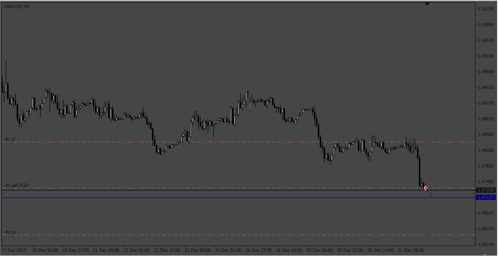
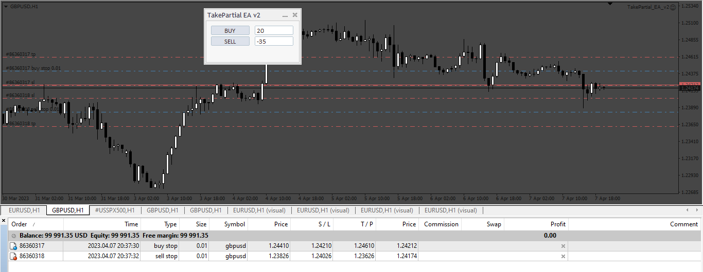
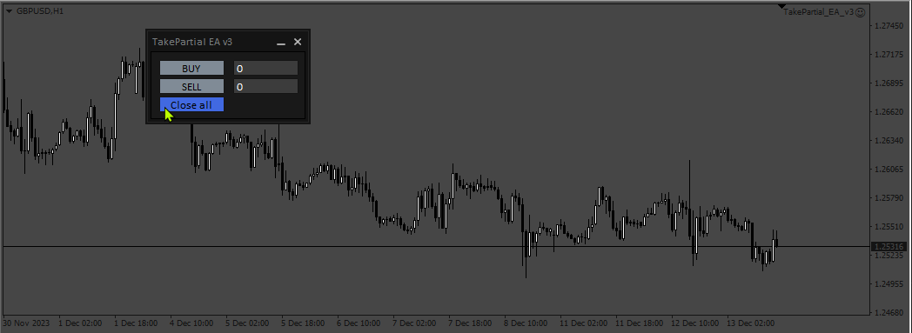
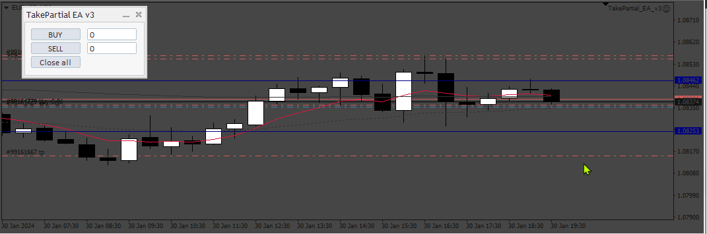

# TakePartial_EA

> Source: https://fxcodebase.com/code/viewtopic.php?f=38&t=73251  
> Forum: 38 · Topic 73251 · 6 post(s)

---

## TakePartial_EA

**Apprentice** · Fri Jan 20, 2023 11:13 am

Based on the request.
[https://fxcodebase.com/code/viewtopic.php?f=17&t=73110](https://fxcodebase.com/code/viewtopic.php?f=17&t=73110)

 [TakePartial_EA.mq4](files/149191/TakePartial_EA.mq4)

---

## Re: TakePartial_EA

**Apprentice** · Fri Apr 07, 2023 2:02 pm

 [TakePartial_EA_v2.mq4](files/150323/TakePartial_EA_v2.mq4)

---

## Re: TakePartial_EA

**Apprentice** · Wed Dec 20, 2023 3:27 am

 [TakePartial_EA_v3.mq4](files/153743/TakePartial_EA_v3.mq4)

---

## Re: TakePartial_EA

**Josan70** · Tue Jan 09, 2024 1:14 pm

Hello, good afternoon. The BE does not work. On the other hand, when you set the SL and TP parameters, they work correctly. If it could be fixed it would be great. Then also when it is put in BE, could it be with BE+ 1 point for example?

Thanks greetings

---

## Re: TakePartial_EA

**Apprentice** · Wed Jan 10, 2024 7:09 am

We have added your request to the development list.
Development reference 37

---

## Re: TakePartial_EA

**Apprentice** · Thu Feb 01, 2024 1:40 pm

 [TakePartial_EA_v4.mq4](files/154245/TakePartial_EA_v4.mq4)
