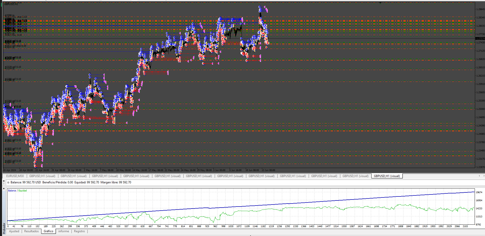

# Tango EA

> Source: https://fxcodebase.com/code/viewtopic.php?f=38&t=76101  
> Forum: 38 · Topic 76101 · 3 post(s)

---

## Tango EA

**Apprentice** · Sun Jun 29, 2025 11:57 am

Based on the request.
[https://fxcodebase.com/code/viewtopic.php?f=38&t=76053](https://fxcodebase.com/code/viewtopic.php?f=38&t=76053)

 [Tango EA.mq4](files/159778/Tango%20EA.mq4)

---

## Re: Tango EA

**Ruman username** · Mon Jun 30, 2025 6:57 am

Thank you for your work. I cant seem to get a positive result in tester though. I will be contacting you again for a job discussion if i can confirm some things. thanks once again. coffee will be on its way

---

## Re: Tango EA

**BeingSimple** · Sat Aug 16, 2025 6:19 am

I tried this EA too.
was not able to get Positive results in backtest on multiple time frames...
Seems needs some improvement

thank you for both of you
