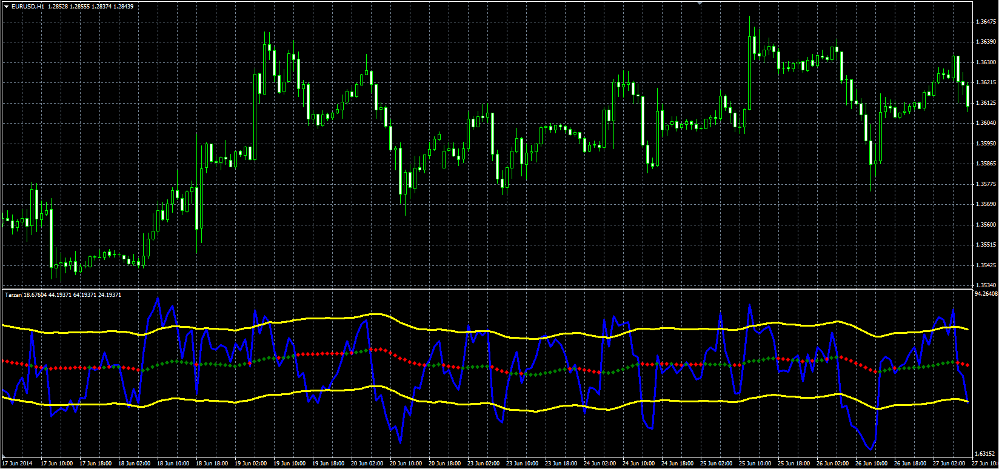

# TARZAN

> Source: https://fxcodebase.com/code/viewtopic.php?f=38&t=61216  
> Forum: 38 · Topic 61216 · 1 post(s)

---

## TARZAN

**Alexander.Gettinger** · Mon Sep 22, 2014 10:49 am

Original LUA oscillator: [viewtopic.php?f=17&t=27989](https://fxcodebase.com/code/viewtopic.php?f=17&t=27989).

Formulas:
Top = MA(RSI)+Koridor,
Bottom = MA(RSI)-Koridor,
MA - moving average with [MA_Length] number of periods and [MA_Method] type, where
RSI - relative strength index with [RSI_Length] number of periods.

 

Download:

 [Tarzan.mq4](files/96077/Tarzan.mq4)
