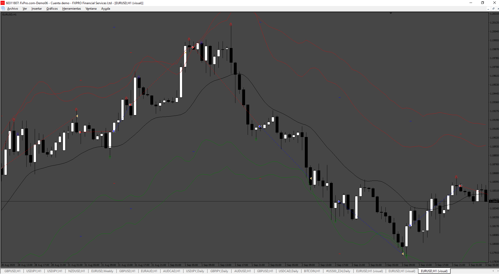

# TBF_EA

> Source: https://fxcodebase.com/code/viewtopic.php?f=38&t=75438  
> Forum: 38 · Topic 75438 · 7 post(s)

---

## TBF_EA

**Apprentice** · Sat Dec 21, 2024 11:40 am

Based on the request.
[https://fxcodebase.com/code/viewtopic.p ... 26#p157526](https://fxcodebase.com/code/viewtopic.php?f=27&p=157526#p157526)

 [TBF.mq4](files/157588/TBF.mq4)

 [TBF_EA.mq4](files/157588/TBF_EA.mq4)

---

## Re: TBF_EA

**trtrader** · Fri Jan 03, 2025 9:38 pm

Could you please build a Grid EA based on these signals? or if you have a good grid EA base, it would be enough to change the main indicator with TBF for entry and exit.

---

## Re: TBF_EA

**Apprentice** · Mon Jan 06, 2025 8:35 am

We have added your request to the development list.
Development reference 9

---

## Re: TBF_EA

**Apprentice** · Thu Jan 23, 2025 5:09 pm

 [TBG_Grid_EA_v1.00.mq4](files/157995/TBG_Grid_EA_v1.00.mq4)

---

## Re: TBF_EA

**trtrader** · Thu Jan 23, 2025 8:36 pm

Could you please add Martingale so it will not close orders until the total is a profit

---

## Re: TBF_EA

**Apprentice** · Sat Feb 01, 2025 5:00 pm

We have added your request to the development list.
Development reference 83

---

## Re: TBF_EA

**Apprentice** · Wed Feb 19, 2025 1:53 pm

[TBG_Grid_EA_v1.10.mq4](files/158330/TBG_Grid_EA_v1.10.mq4)

Try this version.
