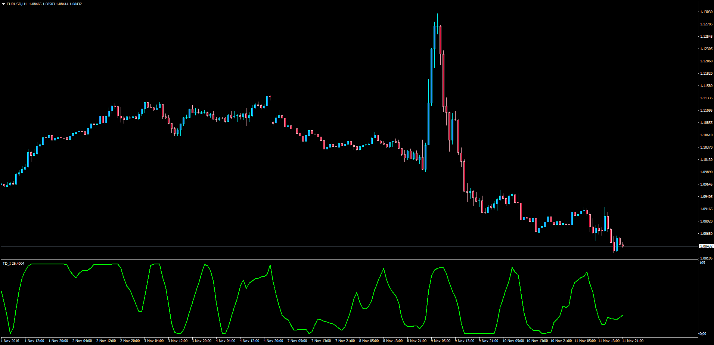

# TD_I Indicator

> Source: https://fxcodebase.com/code/viewtopic.php?f=38&t=64092  
> Forum: 38 · Topic 64092 · 1 post(s)

---

## TD_I Indicator

**Apprentice** · Sat Nov 12, 2016 2:45 pm

LUA Original: [viewtopic.php?f=17&t=2359](https://fxcodebase.com/code/viewtopic.php?f=17&t=2359)

Description:
Transcription from LUA to MT4 of the TD_I concept that goes as follows:

Formulas:

high_diff = Max(0, high[now] - high[now-Shift]);
low_diff = Max(0, low[now-Shift] - low[now]);
high_avg = Average(high_diff) from now to now-Period
low_avg = Average(low_diff) from now to now-Period
TD_Ihigh_avg / (high_avg + low_avg) * 100;

 [TD_I.mq4](files/109030/TD_I.mq4)
