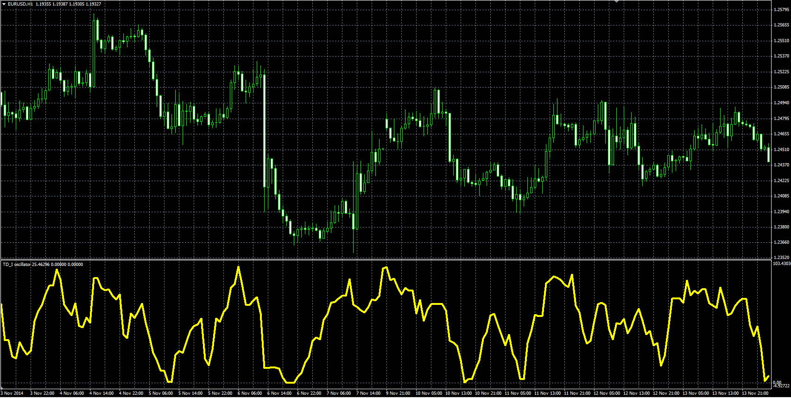

# TD_I oscillator

> Source: https://fxcodebase.com/code/viewtopic.php?f=38&t=61674  
> Forum: 38 · Topic 61674 · 1 post(s)

---

## TD_I oscillator

**Alexander.Gettinger** · Tue Jan 06, 2015 11:50 am

Formula:
TD_I = 100*High_Avg/(High_Avg+Low_Avg), where
High_Avg = MVA(High_Diff) with [Length] number of periods,
Low_Avg = MVA(Low_Diff) with [Length] number of periods,
High_Diff[i] = High[i]-High[pos-Shift],
Low_Diff[i] = Low[i-Shift]-Low[i].

 

Download:

 [TD_I.mq4](files/98017/TD_I.mq4)
