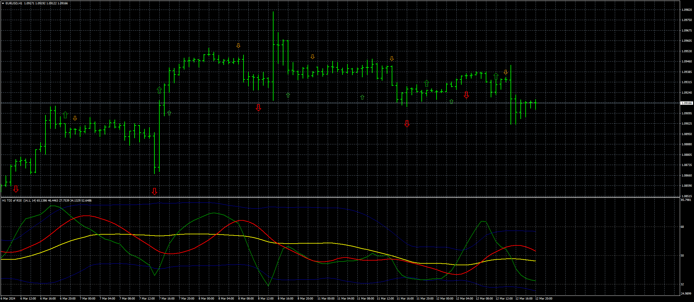
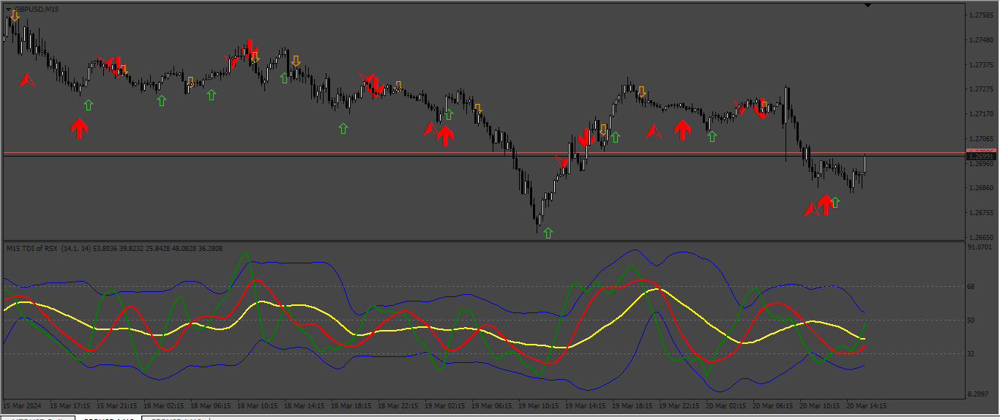

# TDI_Red_Green_(mtf_+_alerts_+arrows)

> Source: https://fxcodebase.com/code/viewtopic.php?f=38&t=74686  
> Forum: 38 · Topic 74686 · 4 post(s)

---

## TDI_Red_Green_(mtf_+_alerts_+arrows)

**Apprentice** · Tue Mar 12, 2024 12:31 pm

Based on the request.
[https://fxcodebase.com/code/viewtopic.php?f=27&p=154432](https://fxcodebase.com/code/viewtopic.php?f=27&p=154432)

 [TDI_Red_Green_(mtf_+_alerts_+arrows).mq4](files/154661/TDI_Red_Green_%28mtf__alerts_arrows%29.mq4)

---

## Re: TDI_Red_Green_(mtf_+_alerts_+arrows)

**HestoriiafxInc** · Wed Mar 13, 2024 3:20 am

Thank you soo micĥ I really appreciate it and your work

Id appreciate if this missing functions are added I'd appreciate if it can be modified

Exit Down Band Arrow as it's only Exit Up band

Entry Up Band Arrow As it's only Entry up Band

For example :

Entering Ob/Os Band : true
Exiting Ob/Os Band Arrows : true

Arrows on entering band up : 233
Arrows On entering Band Down : 234

Arrows exiting band up : 217
Arrows exiting Band Down :218

Arrow Gap : 1.0

---

## Re: TDI_Red_Green_(mtf_+_alerts_+arrows)

**Apprentice** · Sat Mar 16, 2024 10:09 am

We have added your request to the development list.
Development reference 234

---

## Re: TDI_Red_Green_(mtf_+_alerts_+arrows)

**Apprentice** · Mon Mar 25, 2024 5:44 pm

 [TDI_Red_Green_v2.mq4](files/154821/TDI_Red_Green_v2.mq4)
