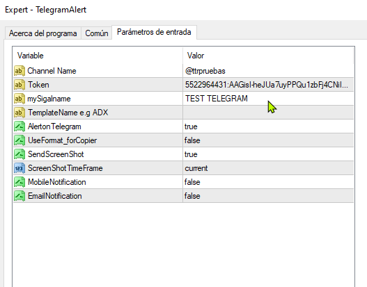
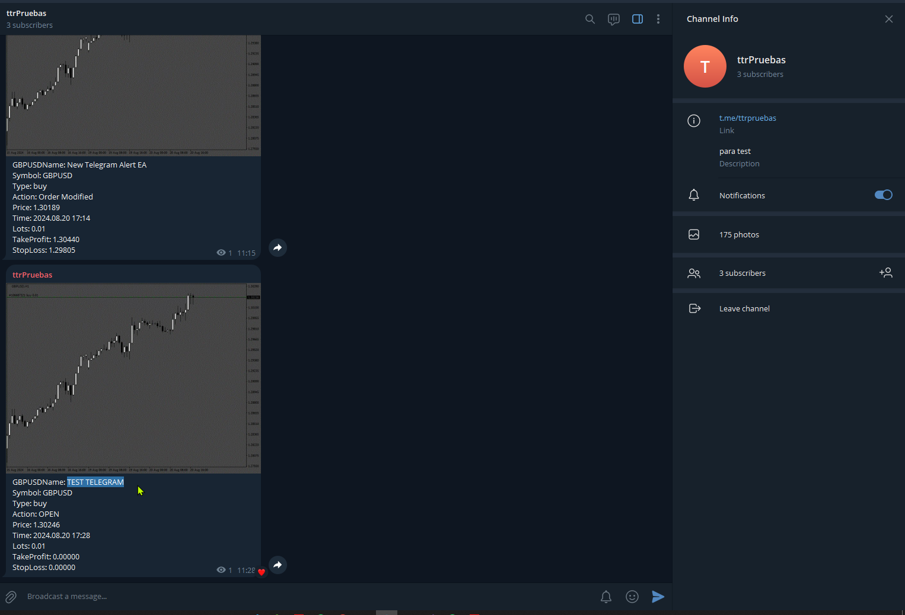
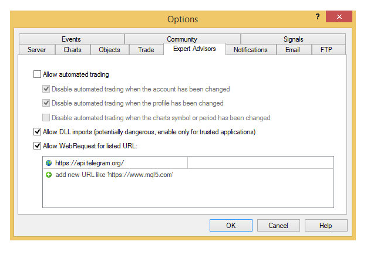
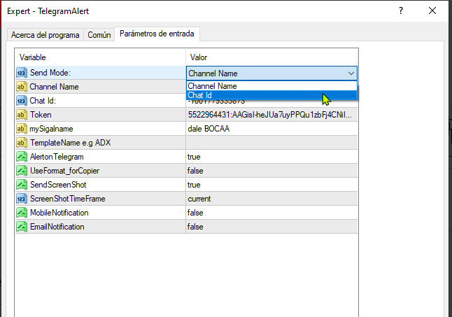
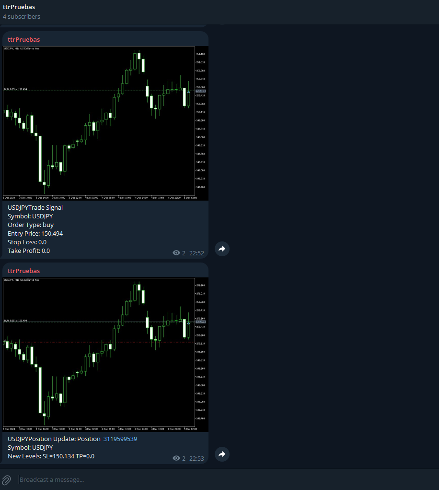
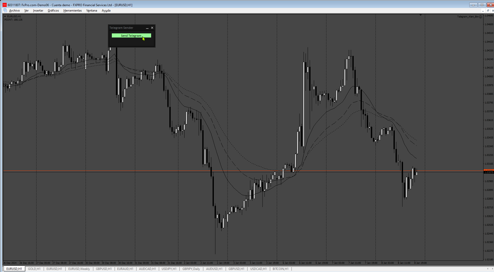
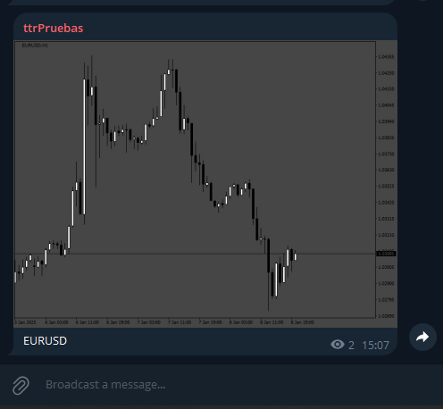
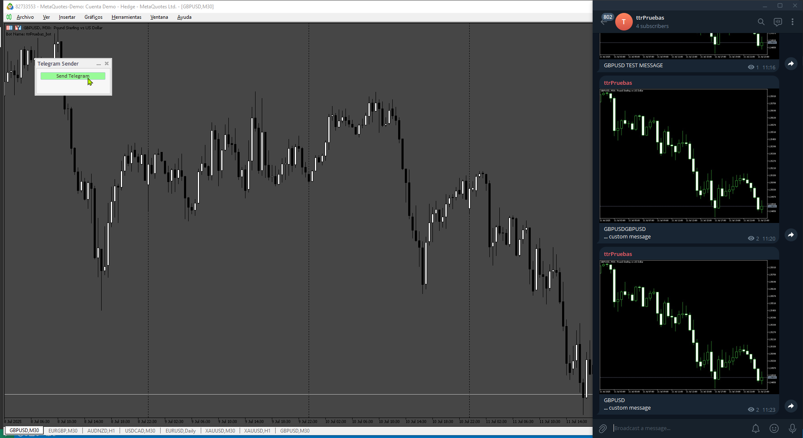
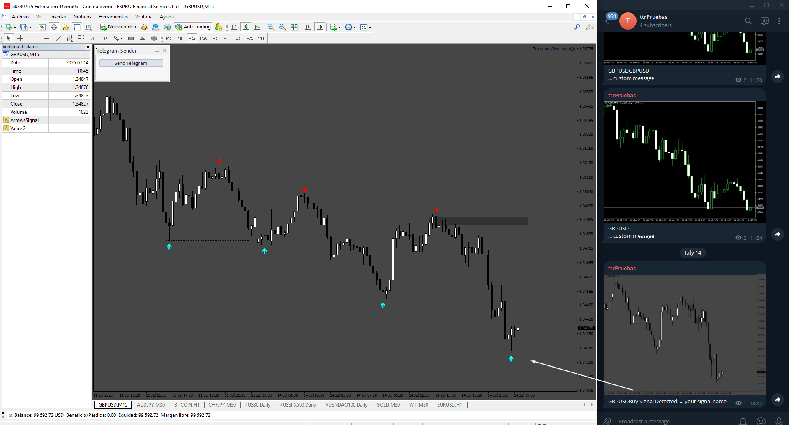

# TelegramAlert

> Source: https://fxcodebase.com/code/viewtopic.php?f=38&t=75160  
> Forum: 38 · Topic 75160 · 28 post(s)

---

## TelegramAlert

**Apprentice** · Sun Aug 25, 2024 4:17 am

 

 

Based on the request.
[https://fxcodebase.com/code/viewtopic.p ... 95#p156395](https://fxcodebase.com/code/viewtopic.php?f=27&p=156395#p156395)

remember to open [https://api.telegram.org](https://api.telegram.org)

 [TelegramAlert.mq4](files/156509/TelegramAlert.mq4)

---

## Re: TelegramAlert

**Frans88** · Sun Aug 25, 2024 8:41 pm

can you change channel name with chat ID? so i can use telegram channel for private channel.

---

## Re: TelegramAlert

**Apprentice** · Sun Sep 01, 2024 3:50 pm

 [TelegramAlert.mq4](files/156555/TelegramAlert.mq4)

---

## Re: TelegramAlert

**ajsupernova** · Fri Nov 22, 2024 3:33 am

Hi!

This is great work! Thank you so much! I have a few questions:

1. Does this send / forward alerts that popup on screen from other indicators that are on the chart? Or does it only send alerts related to orders that are placed, closed, or adjusted via the terminal?

2. If it only sends orders opening and closing alerts, is it possible for it to scan the Experts Log or Journal to pull alerts from other indicators so that I can send the chart images when a specific alert shows on screen on my VPS?

3. Also, is it possible to customize the Telegram Message that gets sent?

Looking forward to your reply! Thanks again!

---

## Re: TelegramAlert

**Pejuang Dolar** · Wed Nov 27, 2024 2:54 am

Please convert to mq5.
I thank you very much in advance...

---

## Re: TelegramAlert

**Apprentice** · Wed Nov 27, 2024 2:42 pm

We have added your request to the development list.
Development reference 876

---

## Re: TelegramAlert

**Apprentice** · Sat Dec 07, 2024 2:32 pm

 [TelegramAlert.mq5](files/157496/TelegramAlert.mq5)

---

## Re: TelegramAlert

**trigga** · Sun Dec 15, 2024 6:04 pm

the mt5 version is not installing and working in metatrader 5.

---

## Re: TelegramAlert

**Apprentice** · Wed Dec 18, 2024 4:36 am

We have added your request to the development list.
Development reference 923

---

## Re: TelegramAlert

**Pejuang Dolar** · Wed Dec 25, 2024 10:40 am

Hi Apprentice,

Please add an option for this EA (mq4 and mq5 versions) to send a notification in the form of a signal, for example a signal from a moving average cross. and in the parameters we can choose the type of notification whether to send when there is an open order or when there is a MA cross signal.

**Thank you very much for your efforts**

---

## Re: TelegramAlert

**Apprentice** · Mon Dec 30, 2024 7:13 pm

[TelegramAlert_v2.mq4](files/157634/TelegramAlert_v2.mq4)

---

## Re: TelegramAlert

**trader77** · Fri Jan 03, 2025 5:02 am

> **Apprentice wrote:**
>
>
> TelegramAlert_v2.mq4

Hi, can you please do 2 things to improve this useful EA.

 1. Make the screenshot on the current chart where we trade into. And possibly the drawn history of the trade. The current set as default even when you change template it will not capture the current chart we trade into.

 2. Add to the text the result of the trade, Pips loss/ profit.

The EA is very useful. Thank you.

---

## Re: TelegramAlert

**trader77** · Sun Jan 05, 2025 3:28 pm

Is it possible to make an indicator that has a button to take screenshot and send it to telegram? Thank you.

---

## Re: TelegramAlert

**Apprentice** · Mon Jan 06, 2025 8:25 am

We have added your request to the development list.
Development reference 4

---

## Re: TelegramAlert

**Apprentice** · Tue Jan 14, 2025 3:52 am

 

 [Telegram_Alert_Btn.mq4](files/157792/Telegram_Alert_Btn.mq4)

---

## Re: TelegramAlert

**jlanino** · Tue Jan 21, 2025 11:16 pm

Hi I find this EA extremely useful for me, but I can´t make it work.... if I push the button to send the screenshot to telegram it works, sends the pic to the chat, but when an alert appears it doesn´t send the content of that alert to the chat.... Don´t know what I´m doing wrong. Now I´m testing the previous version (without button) and same problem.

---

## Re: TelegramAlert

**jollyjegan** · Mon Jan 27, 2025 12:31 pm

> **Apprentice wrote:**
>
>
> 4.png
>
>
>
>
> 4_tlg.png
>
>
>
>
> Telegram_Alert_Btn.mq4

 Add Timer = on/off, If timer is ON, input time in minutes , IF mentioned time reached, send telegram message with screenshot . For example, Timer is set 5 minutes, every 5 minutes send telegram messages repeatedly.
 For both MT4 & MT5 versions.

Thanks in advance.

---

## Re: TelegramAlert

**Apprentice** · Sat Feb 01, 2025 4:45 pm

We have added your request to the development list.
Development reference 73

---

## Re: TelegramAlert

**Apprentice** · Wed Feb 05, 2025 3:58 pm

[Telegram_Alert_Btn_v2.mq4](files/158145/Telegram_Alert_Btn_v2.mq4)

---

## Re: TelegramAlert

**jollyjegan** · Fri Jun 20, 2025 8:04 am

> **Apprentice wrote:**
>
>
> Telegram_Alert_Btn_v2.mq4

Hi Apprentice,

 can you make MT5 (MqL5) version with same options ...Thanks in advance

---

## Re: TelegramAlert

**Apprentice** · Sat Jun 21, 2025 1:03 pm

We have added your request to the development list.
Development reference 402

---

## Re: TelegramAlert

**ajsupernova** · Thu Jul 10, 2025 1:10 am

Hi! Is it possible to have a version of this EA that sends a message to telegram any time ANY indicator on my charts sends a popup alert, or email alert?

I'd like for the screenshot to be available in Telegram along with the alert message. And I'd like for it to happen automatically, I do not want to have to push the button, because I will not be at the terminal when the alert is presented.

Please let me know if this can be done. Thanks!

---

## Re: TelegramAlert

**Apprentice** · Sun Jul 13, 2025 3:34 am

We have added your request to the development list.
Development reference 453

---

## Re: TelegramAlert

**Apprentice** · Tue Jul 15, 2025 11:09 am

 [Telegram_btn.mq5](files/159924/Telegram_btn.mq5)

---

## Re: TelegramAlert

**Apprentice** · Tue Jul 15, 2025 11:16 am

 [Telegram_Alert_Auto.mq4](files/159927/Telegram_Alert_Auto.mq4)

---

## Re: TelegramAlert

**Frans88** · Tue Jul 22, 2025 8:33 pm

Please fix error at MT5 version

---

## Re: TelegramAlert

**Apprentice** · Wed Jul 23, 2025 3:57 am

We have added your request to the development list.
Development reference 473

---

## Re: TelegramAlert

**Apprentice** · Sun Jul 27, 2025 12:27 pm

[Telegram_btn_MT5_v2.mq5](files/160032/Telegram_btn_MT5_v2.mq5)
