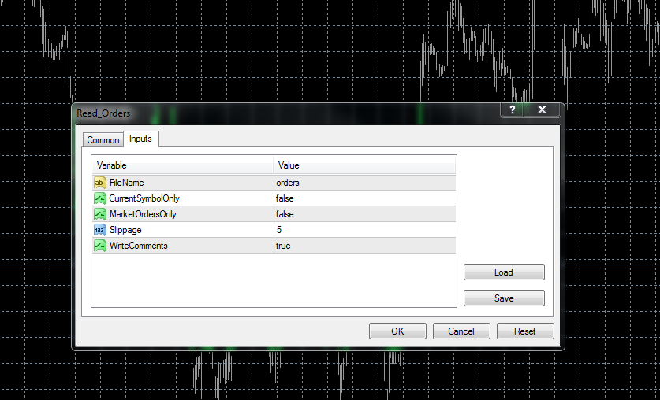

# The script creates orders with the parameters from the file

> Source: https://fxcodebase.com/code/viewtopic.php?f=38&t=59822  
> Forum: 38 · Topic 59822 · 1 post(s)

---

## The script creates orders with the parameters from the file

**Alexander.Gettinger** · Fri Nov 08, 2013 3:46 pm

Format of input file:
[Symbol], [Operation (B/S)], [Open price], [Lots], [SL], [TP], [Magic];

If the price = 0, the script opens a market orders.
If the price is determined, the script creates the pending orders.
The input file should be placed in the folder terminal\experts\files\
The script ignores lines that start with "//".

Download:

 [Read_Orders.mq4](files/90678/Read_Orders.mq4)

Sample of input file:

 [orders.txt](files/90678/orders.txt)
