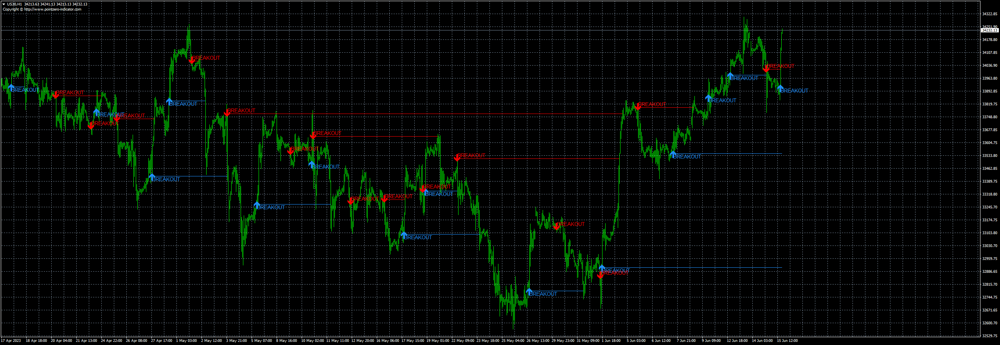
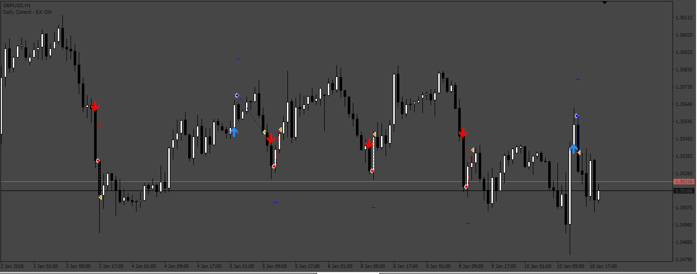
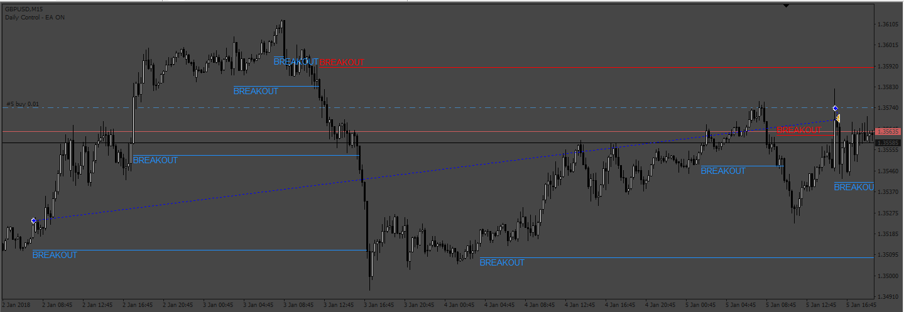

# TheClassicTurtleTrader_no_dots

> Source: https://fxcodebase.com/code/viewtopic.php?f=38&t=73835  
> Forum: 38 · Topic 73835 · 8 post(s)

---

## TheClassicTurtleTrader_no_dots

**Apprentice** · Thu Jun 15, 2023 10:06 am

Based on the request.
[https://fxcodebase.com/code/viewtopic.php?f=38&t=73733](https://fxcodebase.com/code/viewtopic.php?f=38&t=73733)

 [TheClassicTurtleTrader_no_dots.mq4](files/151267/TheClassicTurtleTrader_no_dots.mq4)

---

## Re: TheClassicTurtleTrader_no_dots

**merlin1331** · Thu Jun 15, 2023 2:31 pm

admin , please make an ea for this indicator.

after price touches red breakout line , open sell order.

after price touches blue breakout line , open buy order.

---

## Re: TheClassicTurtleTrader_no_dots

**HestoriiafxInc** · Mon Jun 19, 2023 5:36 pm

Thank you for your work and adding this feature it's absolutely fantastic

Can we turn this to a robot

Rules

open buy positions when current buy arrow closes

open sell positions when current sell arrow closes
And

When candle closes above or below breakout lines close current buy or sell positions and open opposite positions

TAKE PROFIT...

STOP LOSS...

Including
Close opposite trades
TrailingStop/step
Breakeven
Auto lot size
Number of positions
Time start/end
Martingale option

Include indicator Settings

---

## Re: TheClassicTurtleTrader_no_dots

**Apprentice** · Wed Jun 21, 2023 9:19 am

We have added your request to the development list.
Development reference 543.

---

## Re: TheClassicTurtleTrader_no_dots

**Apprentice** · Mon Jun 26, 2023 3:18 pm

 [TheClassicTurtleTrader_no_dots.mq4](files/151424/TheClassicTurtleTrader_no_dots.mq4)

 [The_Classic_Turtle_EA.mq4](files/151424/The_Classic_Turtle_EA.mq4)

---

## Re: TheClassicTurtleTrader_no_dots

**HestoriiafxInc** · Mon Jun 26, 2023 6:23 pm

It's incredible but two features missing

Please add this too

When candle closes above or below breakout lines close current buy or sell positions and open opposite positions (candle close below sell breakout and above buy breakout open positions of that certain direction)

Have option to trade breakouts Or all in one

And also have close opposite direction

---

## Re: TheClassicTurtleTrader_no_dots

**Apprentice** · Sat Jul 01, 2023 6:14 am

We have added your request to the development list.
Development reference 578.

---

## Re: TheClassicTurtleTrader_no_dots

**Apprentice** · Tue Jul 04, 2023 10:49 am

 [The_Classic_Turtle_EA_v2.mq4](files/151511/The_Classic_Turtle_EA_v2.mq4)
