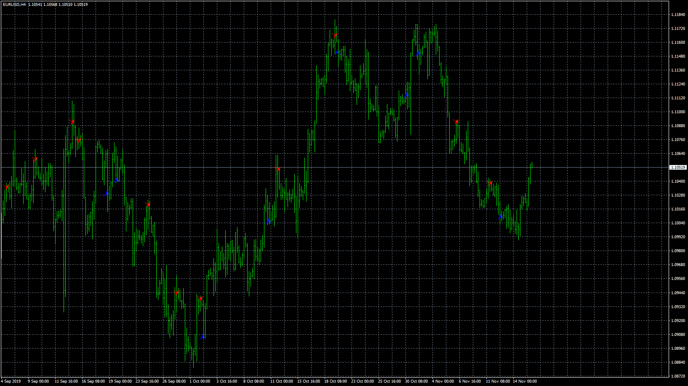

# Three_Inside_Outside_Up_Down_candle_pattern

> Source: https://fxcodebase.com/code/viewtopic.php?f=38&t=69167  
> Forum: 38 · Topic 69167 · 6 post(s)

---

## Three_Inside_Outside_Up_Down_candle_pattern

**Apprentice** · Thu Nov 28, 2019 7:22 am

TS2/Lua version
[viewtopic.php?f=17&t=65037](https://fxcodebase.com/code/viewtopic.php?f=17&t=65037)

 [Three_Inside_Outside_Up_Down_candle_pattern.mq4](files/129980/Three_Inside_Outside_Up_Down_candle_pattern.mq4)

 [Three_Indide_Outside_Up_Down_candles_pattern.mq5](files/129980/Three_Indide_Outside_Up_Down_candles_pattern.mq5)

---

## Re: Three_Inside_Outside_Up_Down_candle_pattern

**siapmn** · Sat Jul 09, 2022 1:21 pm

Dear friend
Is this indicator converted(Lua to MQ4) by a robot?!
Because it is not possible to back test by an expert
And it does not give any signal during back testing
Could you please review it one more time?

---

## Re: Three_Inside_Outside_Up_Down_candle_pattern

**Apprentice** · Mon Jul 11, 2022 4:11 am

This is written as indicator,
you can only backtest EAs.

---

## Re: Three_Inside_Outside_Up_Down_candle_pattern

**dinethlive** · Sun Aug 14, 2022 2:57 pm

Dear Author/Developer,

could you please publish MT5 version of this indicator. Amazing Indicator !
Thank you very much for your effort and time

---

## Re: Three_Inside_Outside_Up_Down_candle_pattern

**Apprentice** · Mon Aug 15, 2022 2:28 am

We have added your request to the development list.
Development reference 476.

---

## Re: Three_Inside_Outside_Up_Down_candle_pattern

**Apprentice** · Wed Aug 24, 2022 3:16 am

Three_Indide_Outside_Up_Down_candles_pattern.mq5 added.
