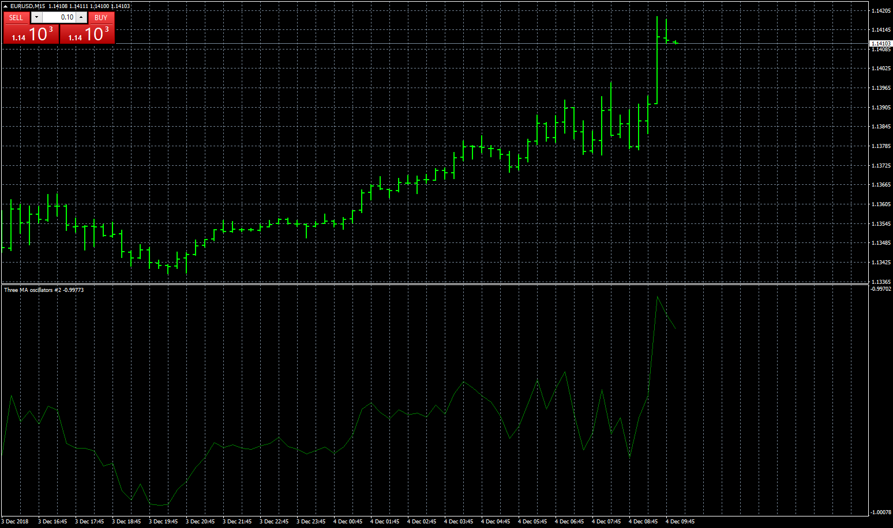

# Three MA oscillators

> Source: https://fxcodebase.com/code/viewtopic.php?f=38&t=67051  
> Forum: 38 · Topic 67051 · 1 post(s)

---

## Three MA oscillators

**Apprentice** · Tue Dec 04, 2018 6:57 am

Based on lua.
[viewtopic.php?f=17&t=67040](https://fxcodebase.com/code/viewtopic.php?f=17&t=67040)
(NoLagMA - EMA) / Close

 [Three MA oscillators.mq4](files/122506/Three%20MA%20oscillators.mq4)

Based on averages.mq4
[viewtopic.php?f=38&t=67050](https://fxcodebase.com/code/viewtopic.php?f=38&t=67050)
