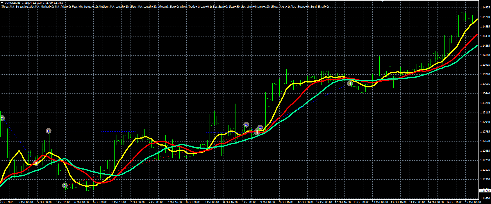

# Three MA strategy

> Source: https://fxcodebase.com/code/viewtopic.php?f=38&t=63296  
> Forum: 38 · Topic 63296 · 1 post(s)

---

## Three MA strategy

**Alexander.Gettinger** · Fri Mar 25, 2016 3:37 pm

The strategy based on 3 Moving Average indicators.

Buy condition: the fast MA crosses over the slow MA.
Sell condition: the fast MA crosses under the slow MA.
Buy close condition: the fast MA crosses under the medium MA and fast MA upper than slow MA.
Sell close condition: the fast MA crosses over the medium MA and fast MA lower than slow MA.

 

Download:

 [Three_MA_Str.mq4](files/105474/Three_MA_Str.mq4)
