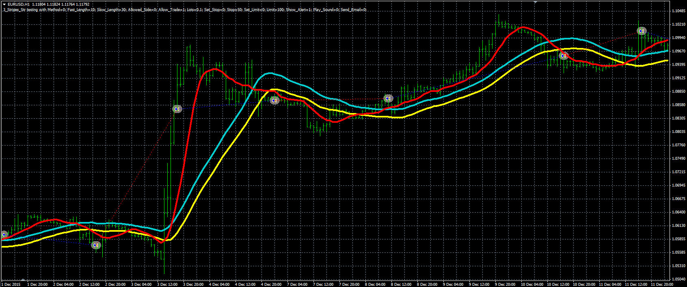

# Three stripes strategy

> Source: https://fxcodebase.com/code/viewtopic.php?f=38&t=63283  
> Forum: 38 · Topic 63283 · 1 post(s)

---

## Three stripes strategy

**Alexander.Gettinger** · Wed Mar 23, 2016 12:12 pm

The strategy based on standard moving average indicator.

Buy condition: Fast MA (Close price) crosses over Slow MA (High price).
Sell condition: Fast MA (Close price) crosses under Slow MA (Low price).

 

Download:

 [3_Stripes_Str.mq4](files/105418/3_Stripes_Str.mq4)
