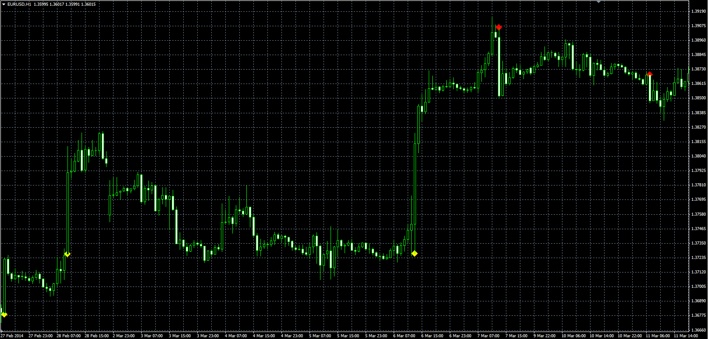

# Thrust Bar

> Source: https://fxcodebase.com/code/viewtopic.php?f=38&t=60767  
> Forum: 38 · Topic 60767 · 13 post(s)

---

## Thrust Bar

**Alexander.Gettinger** · Wed Jun 04, 2014 1:12 pm

Original LUA indicator: [viewtopic.php?f=17&t=60137](https://fxcodebase.com/code/viewtopic.php?f=17&t=60137).

 

Download:

 [Thrust_Bar.mq4](files/94303/Thrust_Bar.mq4)

---

## Re: Thrust Bar

**PaulEamonn** · Sat Oct 25, 2014 9:26 am

Hi Alexander

Many thanks for putting up an MT4 version of the .Lua Thrust Bar indicator. Apologies for not having replied earlier but, for some reason, I didn't get notified that there had been a new post on the thread.

I've managed to get the indicator uploaded on to the chart which is good for me. However, can I be a pain and ask if it can to modified to sound an alarm and show a msgbx when the last tick makes the Open/Last Price spread equal to the ATR*Multiplier in real time?

If this can be done it would improve the indicator's usefulness loads as it would mean I don't need to keep on returning to the PC to check to see if there are any Thrust Bars.

Many thanks in advance.

---

## Re: Thrust Bar

**PaulEamonn** · Thu Jan 19, 2017 12:29 pm

Well, it's been a while since I posted the above request and, as I haven't had an answer, I thought I'd try again just in case it wasn't seen last time.

Adding an alert to this indicator would really help me if it can be done.

Thanks in advance.

---

## Re: Thrust Bar

**Apprentice** · Fri Jan 20, 2017 4:45 am

Your request is added to the development list, Under Id Number 3724
 If someone is interested to do this task, please contact me.

---

## Re: Thrust Bar

**PaulEamonn** · Fri Jan 20, 2017 11:25 am

Thanks Apprentice.

---

## Re: Thrust Bar

**Apprentice** · Sun Mar 12, 2017 1:46 pm

Try it now.

---

## Re: Thrust Bar

**PaulEamonn** · Wed Mar 15, 2017 12:56 pm

Hi Apprentice - thanks for doing this. The problem is I can't seem to make any alarm sound. I've got the indie loaded onto my charts and, when a thrust bar is formed, the msgbx comes up, but there isn't any audible alarm and I can't see any way to set one up.

Can you help me with this please?

---

## Re: Thrust Bar

**Mandelbrot** · Wed Mar 15, 2017 6:09 pm

The sound should be automatic since the Alert is composed of both the Message Box and the Sound.

Can you check Tools->Events and see if the Alert sound is not disabled?

If even with that it still does not work then a PlaySound() can be added.

Note: The sound file must be located in terminal_directory\Sounds or its sub-directory. Only WAV files are played.

 

---

## Re: Thrust Bar

**Apprentice** · Thu Mar 16, 2017 5:02 am

Your request is added to the development list, Under Id Number 3765
 If someone is interested to do this task, please contact me.

---

## Re: Thrust Bar

**PaulEamonn** · Thu Mar 16, 2017 7:58 am

Mandelbrot - You got it in one!

With the old indie I could have the 'Enable' box unchecked in the Events tab and the alarm would still ring. Obviously, with the new system this isn't possible.

So the sound is now working. However, one unwelcome change that I've noticed is that the alarm only rings once when a thrust bar is recognized as having been formed. With the old method the alarm used to ring repeatedly each time a new tick came in right up until the close of the thrust bar. I know this sometimes produced a cacophony of sound, but it was impossible to miss whereas the single iteration of the alarm is.

Is it possible to have the alarm repeat with every new incoming tick like with the old method?

---

## Re: Thrust Bar

**Mandelbrot** · Sun Mar 19, 2017 1:37 pm

Yes, you would get a cacophony of sound the way you want your alert, however even that can be sorted out.

A feature to Alert Every n Seconds has been added, 15 by default.

This translates into alerting every 15 seconds rather than once per bar.

---

## Re: Thrust Bar

**PaulEamonn** · Sat Mar 25, 2017 3:01 pm

Hey Mandlebrot

Thank you for this. It is just what I was looking for. Brilliant!

---

## Re: Thrust Bar

**Alexander.Gettinger** · Wed Sep 20, 2017 2:36 pm

> **PaulEamonn wrote:**
> Well, it's been a while since I posted the above request and, as I haven't had an answer, I thought I'd try again just in case it wasn't seen last time.
>
> Adding an alert to this indicator would really help me if it can be done.
>
> Thanks in advance.

Indicator updated with alert.
