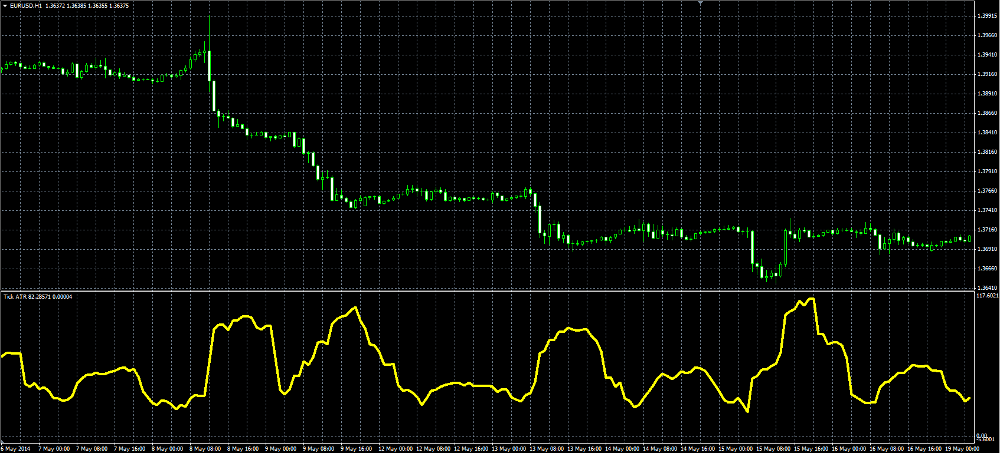

# Tick ATR oscillator

> Source: https://fxcodebase.com/code/viewtopic.php?f=38&t=60796  
> Forum: 38 · Topic 60796 · 1 post(s)

---

## Tick ATR oscillator

**Alexander.Gettinger** · Fri Jun 06, 2014 3:19 pm

Original LUA oscillator: [viewtopic.php?f=17&t=34094](https://fxcodebase.com/code/viewtopic.php?f=17&t=34094).

Formula:
TATR[i] = Moving average(AP, Length, Method), where
AP[i] = Abs(Pirce[i]-Price[i-1]),
Abs - absolute value.

 

Download:

 [TATR.mq4](files/94373/TATR.mq4)
