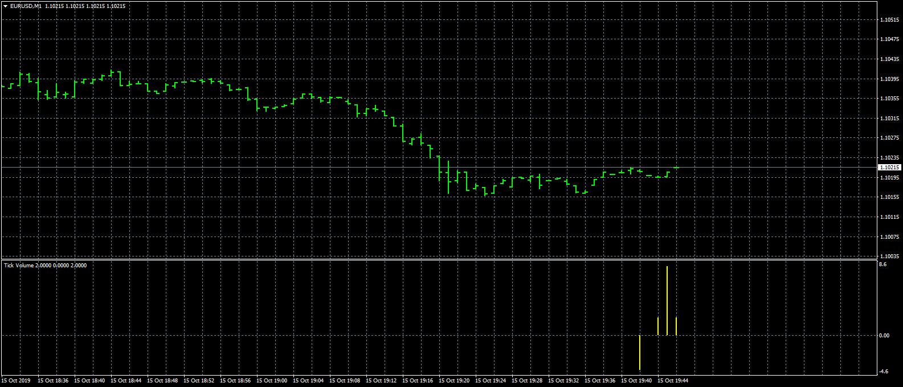
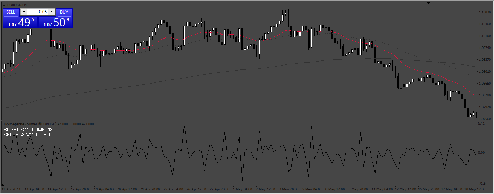

# Tick_Volume

> Source: https://fxcodebase.com/code/viewtopic.php?f=38&t=69019  
> Forum: 38 · Topic 69019 · 9 post(s)

---

## Tick_Volume

**Apprentice** · Tue Oct 15, 2019 1:31 pm

TS2/Lua version
[viewtopic.php?f=17&t=61127](https://fxcodebase.com/code/viewtopic.php?f=17&t=61127)

 [Tick_Volume.mq4](files/129230/Tick_Volume.mq4)

 [Tick_Volume.mq5](files/129230/Tick_Volume.mq5)

---

## Re: Tick_Volume

**branesuraj** · Wed May 10, 2023 6:40 am

I NEED THE LINE VERSION OF THIS INDICATOR WITH OUT PRICE OR PERIOD CALCULATION,
I TRIED A LOT BUT I CAN'T MAKE IT .CAN YOU MAKE IT WITHOUT PRICE? (NOT lIKE OBV,I WANT RAW TICK VOLUMES CUMULATIVE LINE VERSION WITH OUT ANY PRICE CALCULATION)
LIKE THIS ..................

---

## Re: Tick_Volume

**branesuraj** · Sat May 13, 2023 11:56 am

> **branesuraj wrote:**
> I NEED THE LINE VERSION OF THIS INDICATOR WITH OUT PRICE OR PERIOD CALCULATION,
> I TRIED A LOT BUT I CAN'T MAKE IT .CAN YOU MAKE IT WITHOUT PRICE? (NOT lIKE OBV,I WANT RAW TICK VOLUMES CUMULATIVE LINE VERSION WITH OUT ANY PRICE CALCULATION)
> LIKE THIS ..................

Can it be possible?

---

## Re: Tick_Volume

**Apprentice** · Sat May 13, 2023 11:59 am

Candle version of Tick volume?
How will this work?
open and low, will be 0
close and high will be the maximum value for the period.

Will be better to have a line version with only two values.
Previous Value, and current value...

---

## Re: Tick_Volume

**branesuraj** · Sun May 14, 2023 1:58 am

> **Apprentice wrote:**
> Candle version of Tick volume?
> How will this work?
> open and low, will be 0
> close and high will be the maximum value for the period.
>
> Will be better to have a line version with only two values.
> Previous Value, and current value...

I DONT NEED THE CANDLE VERSION. THE LINE VERSION IS ENOUGH, AND IF IT COULD BE DONE WITHOUT PERIOD THEN IT WOULD BE BETTER.

---

## Re: Tick_Volume

**branesuraj** · Sun May 14, 2023 2:14 am

> **Apprentice wrote:**
> Candle version of Tick volume?
> How will this work?
> open and low, will be 0
> close and high will be the maximum value for the period.
>
> Will be better to have a line version with only two values.
> Previous Value, and current value...

I spent a lot of time with this indicator, it would be great if it could be made into a line version
 line version is enough

Below the indicator

---

## Re: Tick_Volume

**Apprentice** · Fri May 19, 2023 7:10 am

We have added your request to the development list.
Development reference 457.

---

## Re: Tick_Volume

**branesuraj** · Wed May 24, 2023 4:06 am

> **branesuraj wrote:**
>
>
> > **Apprentice wrote:**
> > Candle version of Tick volume?
> > How will this work?
> > open and low, will be 0
> > close and high will be the maximum value for the period.
> >
> > Will be better to have a line version with only two values.
> > Previous Value, and current value...
>
>
> I spent a lot of time with this indicator, it would be great if it could be made into a line version
> line version is enough
>
>
> Below the indicator

WATCH THIS INDICATOR A BIT

---

## Re: Tick_Volume

**Apprentice** · Tue Sep 02, 2025 4:08 am

 [TicksVolume.mq4](files/160445/TicksVolume.mq4)
