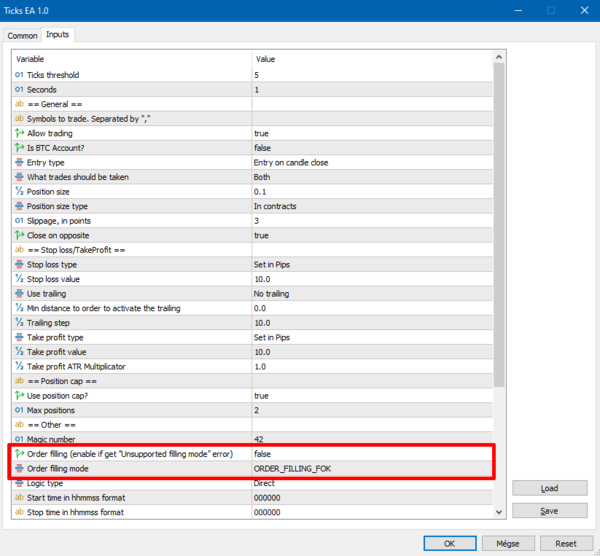

# Ticks EA

> Source: https://fxcodebase.com/code/viewtopic.php?f=38&t=71038  
> Forum: 38 · Topic 71038 · 9 post(s)

---

## Ticks EA

**Apprentice** · Tue Mar 23, 2021 1:28 pm

Based on the request.
[viewtopic.php?f=27&p=141281#p141281](https://fxcodebase.com/code/viewtopic.php?f=27&p=141281#p141281)

 [Ticks EA.mq5](files/141303/Ticks%20EA.mq5)

---

## Re: Ticks EA

**vishal12** · Sun Apr 17, 2022 10:41 am

Hi,
Admin Please have a look @ EA its not opening orders its says
2022.04.17 18:36:18.878	Ticks EA (Jump 25 Index,M1)	Failed to open position: Invalid order filling type.

Please do need full.

Thanks

---

## Re: Ticks EA

**Apprentice** · Tue Apr 19, 2022 9:19 am

Your request is added to the development list.
Development reference 244.

---

## Re: Ticks EA

**vishal12** · Thu Apr 21, 2022 12:21 pm

> **Apprentice wrote:**
> Your request is added to the development list.
> Development reference 244.

Hi Admin
Any update for above reference ?

Thanks

---

## Re: Ticks EA

**vishal12** · Wed May 11, 2022 1:07 pm

> **Apprentice wrote:**
> Your request is added to the development list.
> Development reference 244.

Hi Apprentice any update for my request .
Thanks

---

## Re: Ticks EA

**vishal12** · Thu Oct 13, 2022 10:02 am

Hi Apprentice any update for my request .
Thanks

---

## Re: Ticks EA

**Apprentice** · Tue Oct 18, 2022 2:15 am

Moved to the top of the list.

---

## Re: Ticks EA

**vishal12** · Thu Oct 20, 2022 1:14 pm

> **Apprentice wrote:**
> Moved to the top of the list.

Thanks

---

## Re: Ticks EA

**Apprentice** · Thu Nov 17, 2022 4:15 am

 [Ticks_EA.mq5](files/148384/Ticks_EA.mq5)

Try this version.
