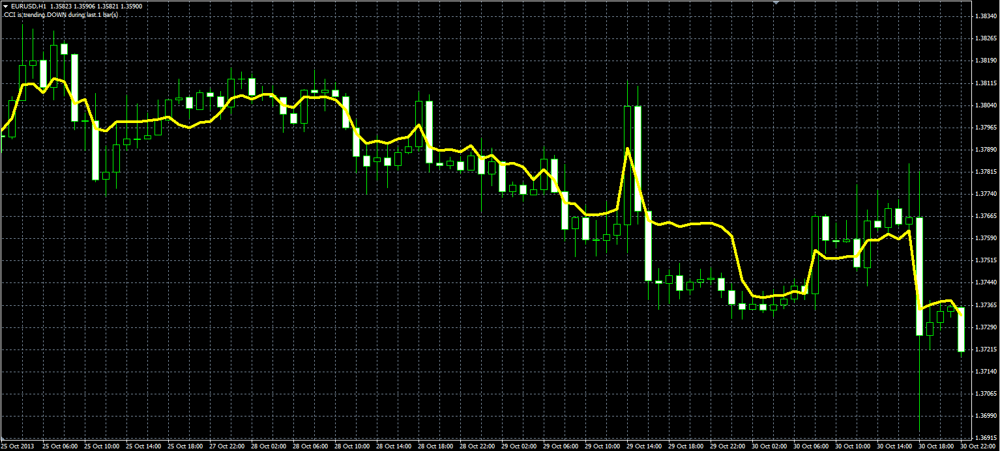
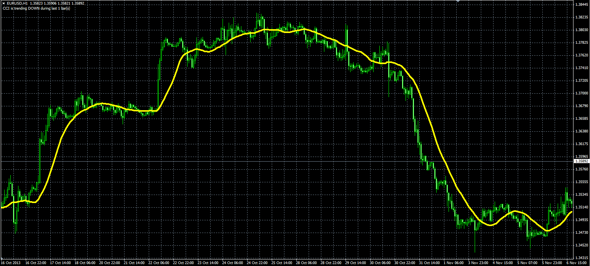

# Time Averaged price and MA

> Source: https://fxcodebase.com/code/viewtopic.php?f=38&t=60046  
> Forum: 38 · Topic 60046 · 3 post(s)

---

## Time Averaged price and MA

**Alexander.Gettinger** · Mon Dec 02, 2013 10:47 am

Original LUA indicators: [viewtopic.php?f=17&t=59655&p=90010](https://fxcodebase.com/code/viewtopic.php?f=17&t=59655&p=90010).

**Time Averaged price:**

 

Download:

 [Time_Averaged_Price.mq4](files/91297/Time_Averaged_Price.mq4)

**Time Averaged MA:**

 

Download:

 [Time_Averaged_MA.mq4](files/91297/Time_Averaged_MA.mq4)

---

## Re: Time Averaged price and MA

**oxbx99** · Tue Nov 03, 2015 3:43 am

Hi Alexander,

Can you please make these 2 indicator to work on Tick chart.

Appreciated.

---

## Re: Time Averaged price and MA

**Apprentice** · Tue Nov 03, 2015 5:54 am

Unfortunately can not be applied to tick charts.
