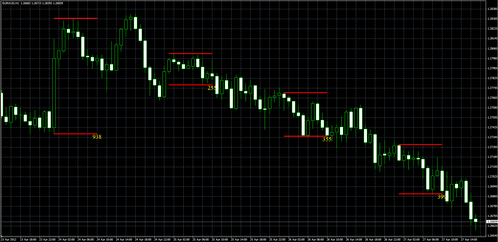

# Time channel indicator

> Source: https://fxcodebase.com/code/viewtopic.php?f=38&t=17247  
> Forum: 38 · Topic 17247 · 19 post(s)

---

## Time channel indicator

**Alexander.Gettinger** · Fri Apr 27, 2012 12:47 pm

The indicator draws the High/Low channel for time range (start hour - end hour).
Near the lower boundary of the channel displays channel size in pips.

 

Download:

 [ChannelInd.mq4](files/31587/ChannelInd.mq4)

---

## Re: Time channel indicator

**Alexander.Gettinger** · Thu May 03, 2012 2:50 pm

I updated the indicator.

---

## Re: Time channel indicator

**Alexander.Gettinger** · Thu May 03, 2012 3:07 pm

Strategies based on this indicator: [viewtopic.php?f=38&t=17654&p=32094#p32094](https://fxcodebase.com/code/viewtopic.php?f=38&t=17654&p=32094#p32094)

---

## Re: Time channel indicator

**Apprentice** · Fri Jan 20, 2017 5:29 am

Indicator was revised and updated.

---

## Time channel indicator

**baccicin** · Tue Jul 21, 2020 8:44 am

Good Afternoon, may I ask you please to add:
- an additional box where you can also enter the time within which to generate the signal
 i mean,
 >StartHour 1
 >EndHour 10
 >FontSize 15
 >TextColor YELLOW
 >>>EndHour for checking the break 20 <<<<<<<--------
- an alert messagge (pop up and sound) if the price breaks the upper or lower line
Many thanks for all, ciao, have a nice evening
Fabio

---

## Re: Time channel indicator

**Apprentice** · Wed Jul 22, 2020 7:22 am

Your request is added to the development list.
Development reference 1749.

---

## Re: Time channel indicator

**Apprentice** · Tue Jul 28, 2020 3:28 pm

[ChannelInd.mq4](files/136372/ChannelInd.mq4)

Try this version.

---

## Re: Time channel indicator

**baccicin** · Wed Jul 29, 2020 7:11 am

As usual you are the best. The indicator is working perfectly.
Many thanks, ciao

---

## Re: Time channel indicator

**baccicin** · Wed Jul 29, 2020 8:28 am

Hi, a supplementary request if it's possible.
Could you please add this function?
The Indicator repeats the alert (sound and pop up) also when the H1 breakout candle closes. Because of these request is that the movement could be so strong to suggest an entry at the breakout but in case the movement is ""normal"" an entry when the candle is close it would be better.
So,we should have 2 alerts, one at the breakout and a second one when the candle is closed.
Many thanks, have a nice day.
Fabio

---

## Re: Time channel indicator

**Apprentice** · Wed Jul 29, 2020 4:07 pm

Your request is added to the development list.
Development reference 1794.

---

## Re: Time channel indicator

**baccicin** · Wed Aug 19, 2020 6:27 am

Hello Apprentice, any news? Many thanks, have a nice day. Fabio

---

## Re: Time channel indicator

**Apprentice** · Tue Sep 01, 2020 2:12 am

[ChannelInd.mq4](files/137192/ChannelInd.mq4)

Try this version.

---

## Re: Time channel indicator

**baccicin** · Mon Oct 05, 2020 9:59 am

Hello, good Evening. Is it possible you change the format HH into HH:MM or another solution that allows the possibility to consiedr just one candle, for example the candle beginning at 12:00 and closes at 13:00? Many thanks, have a ncie evening. Fabio

---

## Re: Time channel indicator

**Apprentice** · Tue Oct 06, 2020 2:26 am

Your request is added to the development list.
Development reference 2150.

---

## Re: Time channel indicator

**Apprentice** · Wed Oct 07, 2020 2:53 am

[ChannelInd.mq4](files/138135/ChannelInd.mq4)

Try this version.

---

## Re: Time channel indicator

**baccicin** · Wed Oct 07, 2020 10:16 am

Hi, thank you. Hours and minutes are ok but the indicator shows the hi and the lo of 2 candles. I mean, i need to indicate the hi and the lo of just one candle, start at 15h00 and end at 15h59'59''.
How can i set the indicator? Many thanks, have a nice evening, Fabio

---

## Re: Time channel indicator

**Apprentice** · Thu Oct 08, 2020 2:21 am

Your request is added to the development list.
Development reference 2161.

---

## Re: Time channel indicator

**Apprentice** · Thu Oct 08, 2020 6:14 am

[ChannelInd.mq4](files/138169/ChannelInd.mq4)

Try this version.

---

## Re: Time channel indicator

**baccicin** · Thu Oct 08, 2020 8:36 am

Perfect, thank you!
