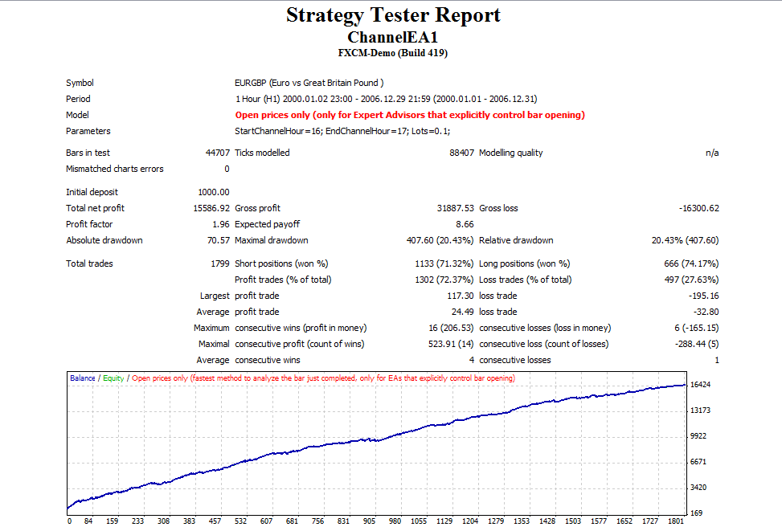
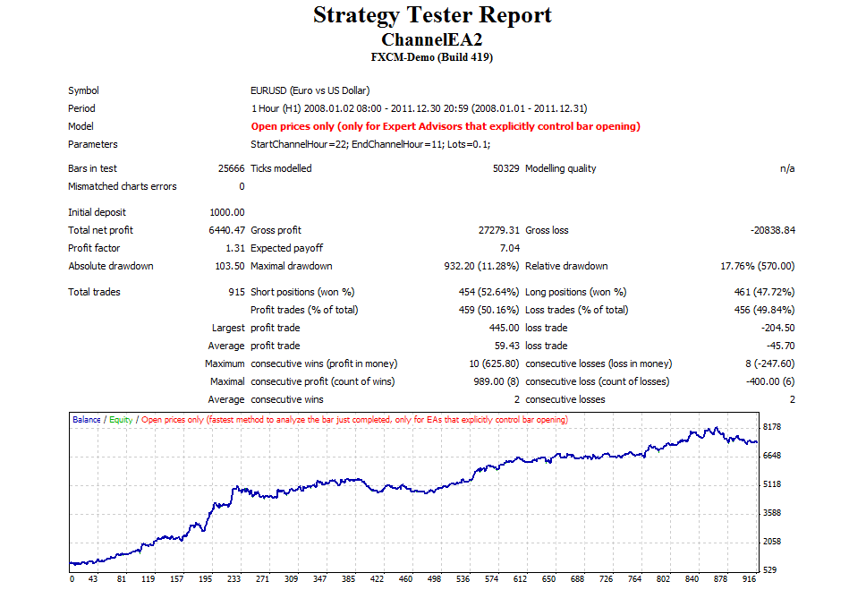

# Time channel strategy

> Source: https://fxcodebase.com/code/viewtopic.php?f=38&t=17654  
> Forum: 38 · Topic 17654 · 5 post(s)

---

## Time channel strategy

**Alexander.Gettinger** · Thu May 03, 2012 3:00 pm

Strategy based on Time channel indicator ([viewtopic.php?f=38&t=17247&p=32093#p32093](https://fxcodebase.com/code/viewtopic.php?f=38&t=17247&p=32093#p32093)).

The indicator calculates the upper and lower borders of the channel and place pending orders on them.
BUY order is placed at lower border with limit on upper border, and SELL order is placed at upper border with limit on lower border. Stop orders are not placed. If any order activated, second order is removed. At the beginning of the next channel open orders will be closed.

 

Download:

 [ChannelEA1.mq4](files/32094/ChannelEA1.mq4)

---

## Re: Time channel strategy

**Alexander.Gettinger** · Thu May 03, 2012 3:06 pm

The inverse strategy.

BUY order is placed at upper border with stop on lower border, and SELL order is placed at lower border with stop on upper border. Limit orders are not placed. If any order activated, second order is removed. At the beginning of the next channel open orders will be closed.

 

Download:

 [ChannelEA2.mq4](files/32095/ChannelEA2.mq4)

---

## Re: Time channel strategy

**db_mansa** · Sun Nov 25, 2012 1:39 am

Can u please edit 50% TP of upper line and lower line in channel EA.....!? I think this can cut loss trades a little more...Thanks for this nice strategy.....

---

## Re: Time channel strategy

**Apprentice** · Sun Nov 25, 2012 5:38 am

Your request is added to the development list.

---

## Re: Time channel strategy

**Alexander.Gettinger** · Wed Dec 19, 2018 9:30 pm

Please try this strategy:

 [ChannelEA3.mq4](files/122958/ChannelEA3.mq4)
