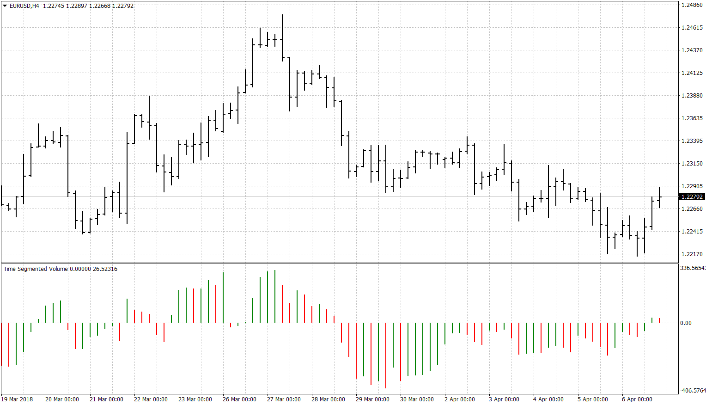
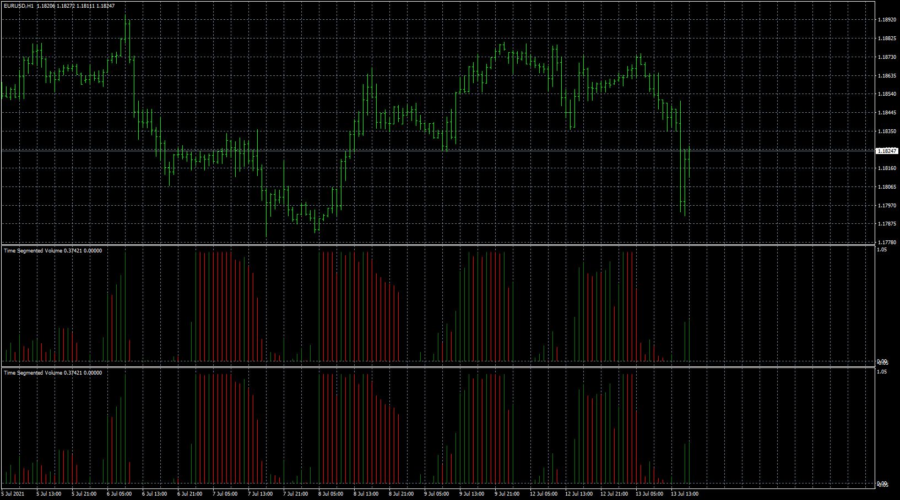
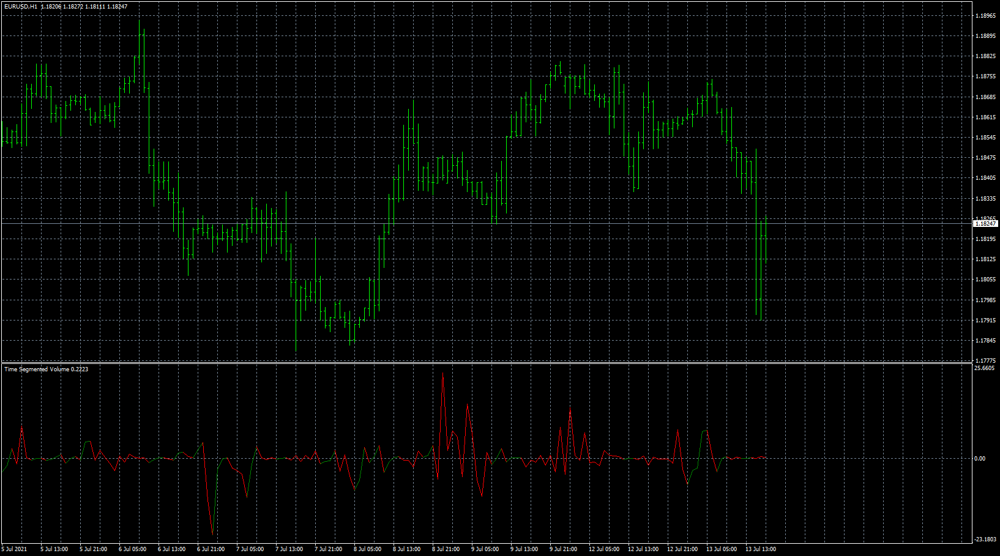
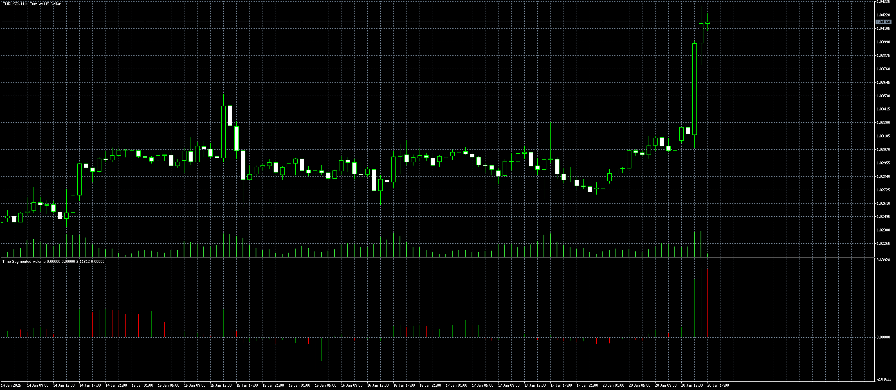

# Time Segmented Volume

> Source: https://fxcodebase.com/code/viewtopic.php?f=38&t=65882  
> Forum: 38 · Topic 65882 · 14 post(s)

---

## Time Segmented Volume

**Apprentice** · Sat Apr 07, 2018 3:59 pm

Based on the lua original.
[viewtopic.php?f=17&t=33848](https://fxcodebase.com/code/viewtopic.php?f=17&t=33848)

Time Segmented Volume (TSV) is a technical indicator developed by Worden Brothers Inc.
Positiv TSV suggests accumulation or buying pressure,
Negativ TSV suggests distribution or selling pressure.

Positive or negative divergences between price and TSV suggests potential tops and bottoms.

 [Time Segmented Volume.MQ4](files/118514/Time%20Segmented%20Volume.MQ4)

 [Time Segmented Volume Line.MQ4](files/118514/Time%20Segmented%20Volume%20Line.MQ4)

---

## Re: Time Segmented Volume

**virtuado** · Fri Jul 13, 2018 9:19 pm

Thanks for the interesting indicator.

I would really appreciate it if this indicator could be coded with a line instead of histogram?

Before asking i tried myself, but the best result was 2 lines...

---

## Re: Time Segmented Volume

**Apprentice** · Sun Jul 15, 2018 4:57 am

Time Segmented Volume Line.MQ4 added.

---

## Re: Time Segmented Volume

**virtuado** · Sun Jul 15, 2018 9:56 am

Tnx Apprentice, much appreciated!

---

## Re: Time Segmented Volume

**mouakkit.latifa** · Tue Jul 27, 2021 3:34 am

thnak you for answer
can you make Time Segmented Volume normalized add please time frames and symbols

---

## Re: Time Segmented Volume

**Apprentice** · Thu Jul 29, 2021 3:46 am

Your request is added to the development list.
Development reference 701.

---

## Re: Time Segmented Volume

**Apprentice** · Fri Jul 30, 2021 1:33 pm

Try this version.

 [Time_Segmented_Volume_Norm.mq4](files/143040/Time_Segmented_Volume_Norm.mq4)

 [Time_Segmented_Volume_Norm_BTF_OS.mq4](files/143040/Time_Segmented_Volume_Norm_BTF_OS.mq4)

---

## Re: Time Segmented Volume

**mouakkit.latifa** · Fri Jul 30, 2021 6:18 pm

thank you for indicator
but somthing wrong Time_Segmented_Volume_Norm_BTF_OS
when you change to other pairs the indicator change
put any symbol on this indicator and change to any paurs in same chart the indicator somthing wrong is not correct

---

## Re: Time Segmented Volume

**Apprentice** · Mon Aug 02, 2021 12:43 am

Your request is added to the development list.
Development reference 708.

---

## Re: Time Segmented Volume

**Apprentice** · Wed Aug 04, 2021 4:34 am

 [TSV.mq4](files/143073/TSV.mq4)

 [TSV_with_divergence.mq4](files/143073/TSV_with_divergence.mq4)

---

## Re: Time Segmented Volume

**mouakkit.latifa** · Wed Aug 04, 2021 7:10 am

its not at all what i did ask
thnks anyway

---

## Re: Time Segmented Volume

**peterhw** · Mon Oct 31, 2022 11:59 am

Mario

Would be great to see an MT5 version of your Time Segmented Volume
[https://fxcodebase.com/code/viewtopic.php?f=38&t=65882](https://fxcodebase.com/code/viewtopic.php?f=38&t=65882)

---

## Re: Time Segmented Volume

**Apprentice** · Mon Oct 31, 2022 12:10 pm

We have added your request to the development list.
Development reference 699.

---

## Re: Time Segmented Volume

**Apprentice** · Mon Jan 20, 2025 10:10 am

 [Time_Segmented_Volume.mq5](files/157901/Time_Segmented_Volume.mq5)
