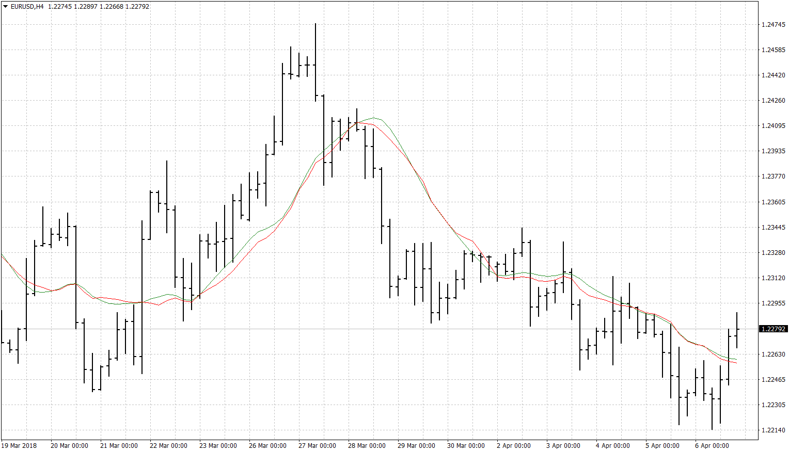

# Time/Volume Weighted Average Price

> Source: https://fxcodebase.com/code/viewtopic.php?f=38&t=65881  
> Forum: 38 · Topic 65881 · 1 post(s)

---

## Time/Volume Weighted Average Price

**Apprentice** · Sat Apr 07, 2018 3:40 pm

Based on the post.
[https://blog.csdn.net/u012234115/articl ... s/72830003](https://blog.csdn.net/u012234115/article/details/72830003)

 [Time Weighted Average Price.MQ4](files/118513/Time%20Weighted%20Average%20Price.MQ4)

 [Volume Weighted Average Price.MQ4](files/118513/Volume%20Weighted%20Average%20Price.MQ4)
